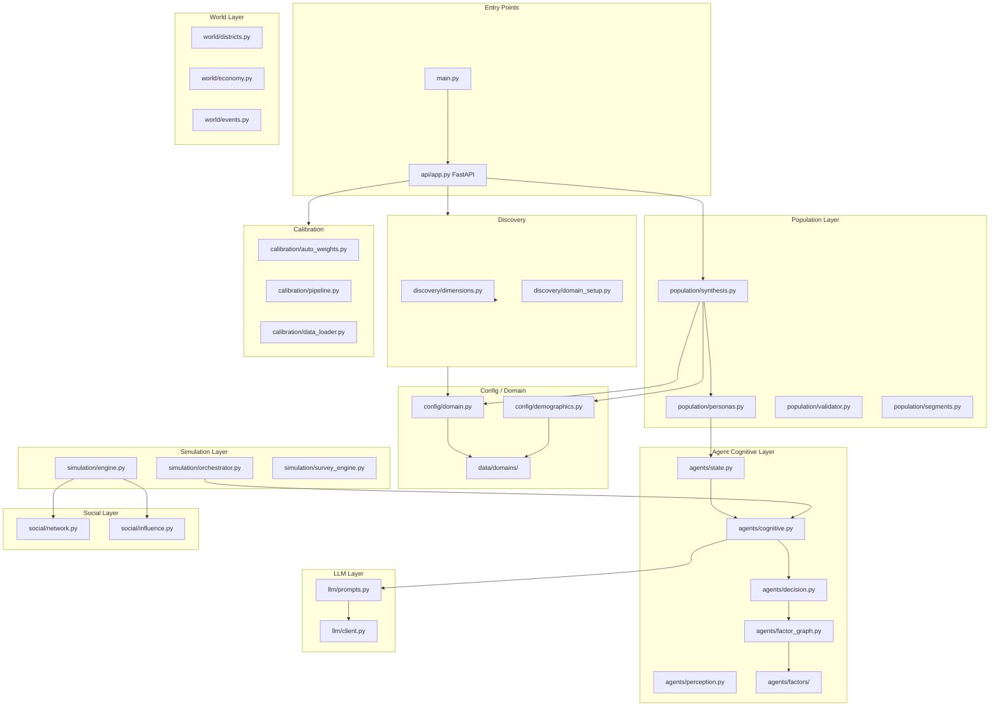
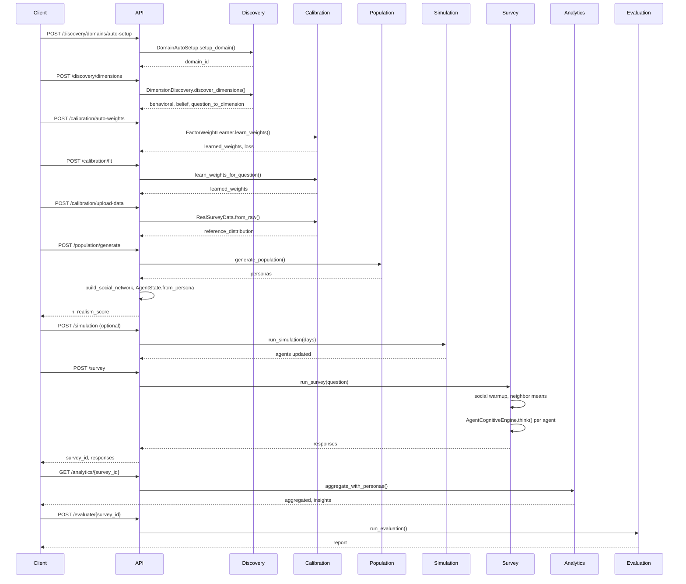
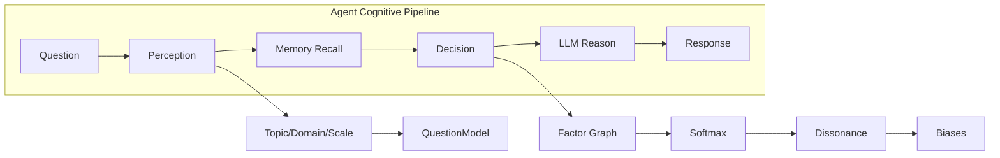
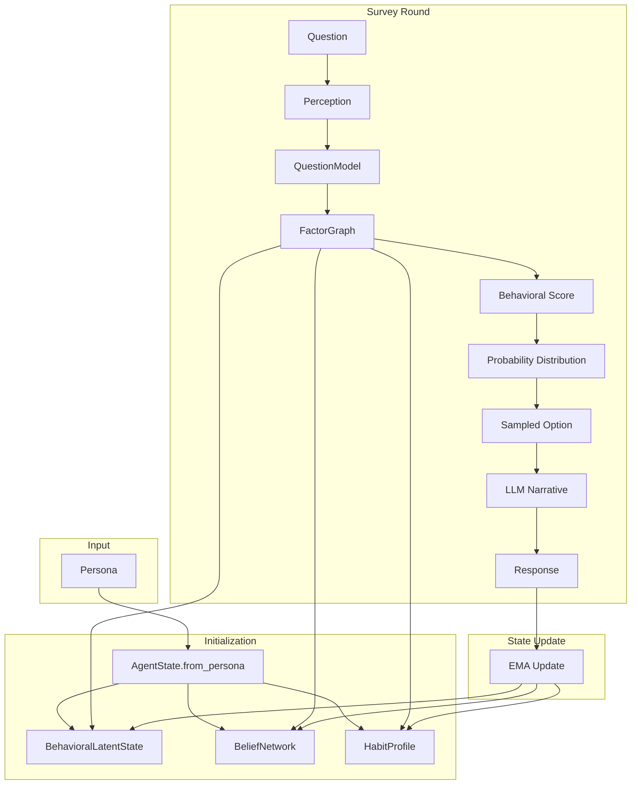
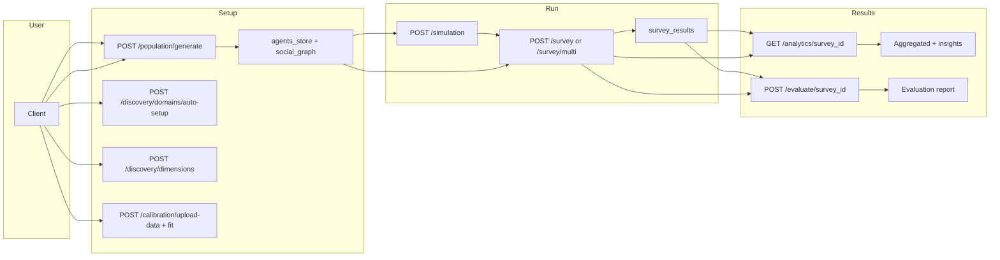

# JADU Architecture

This document describes the system flow, data pipelines, and component interactions of the JADU synthetic society simulation platform.

## High-Level Component Diagram

## API Request Flow

## Cognitive Pipeline (Survey Mode)

When an agent answers a survey question, the following pipeline executes:

**Steps:**

1. **Perception** (`agents/perception.py`): Extract topic, domain, scale type, and question-model key from the question text. Uses keyword matching with optional LLM fallback for unknown questions.

2. **Memory Recall** (`memory/store.py`): Retrieve top-k relevant memories by semantic similarity (ChromaDB) or keyword match (in-memory fallback).

3. **Decision** (`agents/decision.py`):
   - Build `DecisionContext` (persona, traits, perception, friends_using, location_quality, memories, environment)
   - Factor graph computes weighted score from: personality, income, social, location, memory, behavioral, belief
   - Convert to probability distribution via softmax (with per-agent temperature)
   - Apply habit bias, cultural prior, conviction shaping
   - Apply cognitive dissonance (consistency with beliefs/behavior)
   - Apply memory rules (cross-question consistency)
   - Apply bounded-rational biases (confirmation, loss aversion, anchoring, bandwagon, availability)
   - Sample from distribution (nucleus sampling with resample guard)

4. **LLM Reason** (`llm/prompts.py`): Generate narrative answer from persona + question + sampled option. Uses style profiles, banned-pattern retry, consistency validation.

5. **State Update**: EMA-update `BehavioralLatentState` and `BeliefNetwork`; populate `structured_memory` for cross-question influence.

## Simulation 13-Step Daily Loop

The simulation kernel (`simulation/engine.py`) runs a causally-correct 13-step pipeline each day:

| Step | Module | Description |
|------|--------|-------------|
| 1 | `world/events.py` | Process scheduled events (price_change, policy, infrastructure, etc.) |
| 2 | `research/engine.py` | Build shared research context for factual grounding |
| 3 | `media/framing.py` | Generate media frames (event → narrative per source) |
| 4 | `media/exposure.py` | Raw selective exposure (subscription filter) |
| 5 | `media/attention.py` | Adaptive attention (emotion-gated exposure reweighting) |
| 6 | `world/life_events.py` | Sample and apply life events (marriage, job change) |
| 7 | `world/culture.py` | Apply cultural influence (district norms) |
| 8 | `media/exposure.py` | Cognitive processing — update beliefs from media |
| 9 | `media/exposure.py` | Compute alignment (updated beliefs vs media frames) |
| 10 | `simulation/cascade_detector.py` | Update activation (emotional layer) |
| 11 | `agents/vectorized.py` | Social diffusion (behavioral + beliefs via sparse adjacency) |
| 12 | `simulation/cascade_detector.py` | Cascade detection, emergent event generation, fatigue |
| 13 | `simulation/macro.py`, `simulation/world_feedback.py` | Macro feedback + world state updates (optional demand-driven events) |

**Execution paths:**
- **Vectorized** (≥200 agents): Matrix operations on trait/belief matrices, sparse graph diffusion
- **Scalar** (<200 agents): Per-agent loop with neighbor mean computation

## Domain and Demographics

Persona generation and survey flows can use domain-specific configuration:

- **Domain config** (`config/domain.py`): `get_domain_config(domain_id)` loads from `data/domains/{domain_id}/domain.json` (city_id, districts, topic_keywords, cultural_priors, system_prompts, etc.).
- **Demographics** (`config/demographics.py`): Loads from `data/domains/{domain_id}/demographics.json` (marginals and conditionals for age, nationality, income, location, occupation). Replaces or complements hardcoded `config/dubai_data.py` for new cities.
- **Adding a city**: Create `data/domains/{city_id}/domain.json` and `demographics.json` (see `data/domains/dubai/` as template). Discovery can auto-setup domains via `POST /discovery/domains/auto-setup`.

## Data Flow: Persona to Survey Response

## Multi-Question Survey Flow

For `POST /survey/multi`:

1. **SurveyEngine** schedules rounds on an `EventDrivenScheduler` timeline
2. Each round: `run_survey()` → all agents answer one question
3. Between rounds: social diffusion (vectorized or hybrid archetype), memory summarization
4. Optional: periodic archetype reclustering to track evolving behavior
5. Progress streams via WebSocket; results stored per round

## Archetype Compression

When `use_archetypes=true` and population > 500:

1. **build_archetype_map**: KMeans cluster personas by lifestyle + demographics
2. **Representatives**: One agent per cluster calls LLM
3. **Non-representatives**: Get adapted narrative via token substitution (location, cuisine, hobby, etc.) from representative's response — only if sampled option matches
4. **Fallback**: If option differs or open_text, fresh LLM call

This reduces LLM calls from N to ~80 for 500 agents.

## Calibration Flow

Calibration tunes factor weights (and optionally other parameters) so simulated survey distributions match real-world reference data.

1. **Upload real data** (`POST /calibration/upload-data`): Client sends question, responses list, optional demographics. `RealSurveyData.from_raw()` builds an in-memory dataset; `to_reference_distribution()` returns option → proportion. Used as target for optimization.
2. **Learn weights for one question** (`POST /calibration/fit`): `FactorWeightLearner.learn_weights_for_question(question, reference_distribution, agents)` runs differential evolution: at each iteration, a default simulator runs the decision pipeline (perceive → factor graph with candidate weights → sample) on a subset of agents to get a simulated distribution; objective is Jensen–Shannon divergence to reference. Returns learned_weights, best_loss, converged.
3. **Learn weights for many questions** (`POST /calibration/auto-weights`): Same learner with questions + reference_distributions dict; one optimization per question; returns overall_loss and per-question results. Optional pipeline: holdout split → train refs → learn → validate on test refs (see calibration/pipeline.py).

## Discovery Flow

Discovery creates new domains and infers behavioral/belief dimensions from sample questions.

1. **Auto-setup domain** (`POST /discovery/domains/auto-setup`): `DomainAutoSetup.setup_domain(domain_name, description, sample_questions, city_name, currency, reference_data)` generates a domain_id (slug from name), creates `data/domains/{domain_id}/`. Uses LLM to generate domain.json skeleton (topic_keywords, services, system_prompts, lifestyle_keywords). Runs dimension discovery on sample_questions and saves to discovered_dimensions.json if successful. Optionally generates question model overrides via LLM. Writes demographics.json stub if missing. If reference_data provided, writes reference_distributions.json. Returns domain_id.
2. **Discover dimensions** (`POST /discovery/dimensions`): `DimensionDiscovery.discover_dimensions(questions, n_behavioral, n_belief)` embeds questions (sentence-transformers), clusters (e.g. KMeans), assigns questions to dimensions, uses LLM to name/describe dimensions. Returns behavioral list, belief list, question_to_dimension mapping. If save=true and domain_id given, `save_discovered_dimensions(domain_id, result)` persists to `data/domains/{domain_id}/discovered_dimensions.json`.

## Evaluation Flow

After a survey is run, evaluation produces a report (realism, drift, consistency, distribution fit, narrative similarity, optional LLM judge).

1. **Input**: survey_id; API looks up survey_results[survey_id] for responses and uses agents_store for personas. Optional request body: run_judge, judge_sample, realism_threshold, drift_threshold, run_similarity, similarity_threshold.
2. **Population realism**: `compute_realism_report(personas, threshold)` → validate_population (JS divergence of marginals vs target) → population_realism_score, passed, per_attribute.
3. **Drift**: response_histories updated with this survey’s responses; `drift_report(personas, response_histories, threshold)` → infer_current_behavior from history, compare to persona baseline → drifted_agent_ids, count, rate.
4. **Consistency**: If ≥2 questions in response_histories, build response_sets per question_id; `consistency_score_from_responses(response_sets, agent_ids)` → pairwise check_frequency_consistency (e.g. "rarely" vs "5 times") → average rate.
5. **Distribution validation**: `validate_survey_distribution(responses, reference)` → aggregate_survey_distribution, compare_to_reference (JS, chi-square) → passed, js_similarity.
6. **Narrative similarity**: If run_similarity, extract narrative answers; `compute_narrative_similarity(narratives, threshold)` → embeddings, cosine similarity → duplicate_rate, flagged_pairs.
7. **LLM judge** (optional): If run_judge, sample agents; `judge_responses_batch(personas, questions, responses, sample_size)` → judge_response per sample (realism, persona_consistency, cultural_plausibility 1–5).
8. **Output**: Dashboard (duplicate_narrative_rate, persona_realism_score, distribution_similarity, consistency_score, drift_rate, mean_judge_score), quantitative_metrics pass/fail vs QUALITY_TARGETS, summary. Report can be exported to JSON via export_evaluation_report.

## End-to-End Project Flow

Single path from user actions to results:

Typical order: (1) Optionally run discovery and calibration to add a domain or tune weights. (2) Generate population. (3) Optionally run simulation for some days. (4) Run survey (single or multi). (5) Get analytics and/or run evaluation on the survey_id.

## Key Dependencies

- **Persona** → AgentState (via `AgentState.from_persona`)
- **AgentState** → BehavioralLatentState, BeliefNetwork, HabitProfile
- **QuestionModel** → FactorGraph (cached per model name)
- **Social graph** → friends_using_delivery, neighbor_latent_mean (injected into DecisionContext)
- **World events** → event_dimension_impacts, event_belief_impacts (in scheduler environment)
- **Domain** → `get_domain_config(domain_id)` used by synthesis, discovery, and calibration; demographics from `data/domains/{id}/demographics.json`
