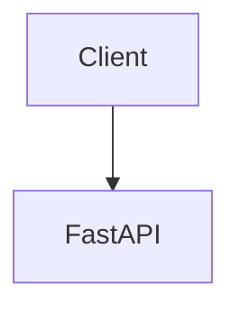

# JADU API page template

Use this section order for every topic page under `docs/jadu-api/` so the reference reads as one coherent spec.

1. **Purpose & prerequisites** — What must exist first (`agents_store`, `survey_results`, domain files, API keys).
2. **HTTP contract** — Method, path, query/body; Pydantic model names with link to [`api/schemas.py`](../../api/schemas.py) or inline route models.
3. **Full request example** — Copy-paste JSON valid against the schema.
4. **Full response example** — JSON or a field table with types.
5. **Response field ledger** — Table: field → type → meaning → formula or algorithm → `file.py:function`.
6. **Execution trace (numbered)** — `FastAPI` route → callee chain with `path:symbol`.
7. **Diagram** — At least one Mermaid `flowchart` or `sequenceDiagram` for the main flow (valid Mermaid: camelCase node IDs, `subgraph id [Label]`).
8. **Key types** — Dataclasses / classes touched; where defined; which fields matter for this endpoint.
9. **Configuration & data files** — [`config/settings.py`](../../config/settings.py), domain JSON under `data/domains/*/`, etc.
10. **Worked numeric mini-example** — Toy data and step-by-step arithmetic where math is non-obvious.
11. **Known limitations / caveats** — Honest notes (stubs, mismatched scales, aggregation keys).
12. **Cross-links** — e.g. [Module Reference / API](../modules/api.md) for architecture depth; avoid duplicating whole module docs.

---

**Mermaid fences (MkDocs Material):**

````markdown

````

Do not use spaces in node IDs; avoid node id `end`.
