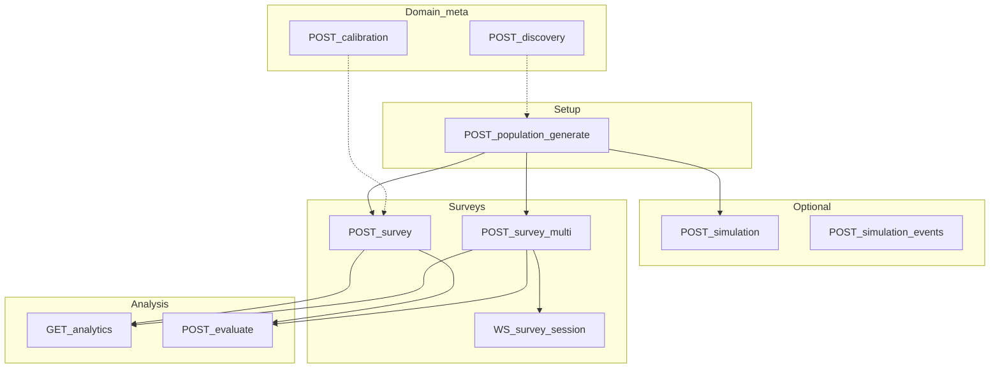

# JADU API reference (Postman collection)

This section documents HTTP endpoints aligned with [`postman/JADU_Full_API.postman_collection.json`](../../postman/JADU_Full_API.postman_collection.json). Links to `../../…` in topic pages point at **source files in the repository** (useful on GitHub or in a local clone; they are not copied into the static docs site): **request/response fields**, **why parameters exist**, **execution traces** (route → functions → modules), and **how numeric outputs are computed**.

**Page template:** See [DOC_TEMPLATE.md](DOC_TEMPLATE.md) for the standard section order used across topic pages.

| Document | Scope |
|----------|--------|
| [population.md](population.md) | `POST /population/generate` |
| [agents.md](agents.md) | `GET /agents`, `GET /agents/:agent_id` |
| [survey.md](survey.md) | Single survey, results, multi-session, rounds |
| [simulation.md](simulation.md) | Days run, events, scenarios, causal |
| [analytics.md](analytics.md) | `GET /analytics/:survey_id` |
| [evaluation.md](evaluation.md) | `POST /evaluate/:survey_id`, `GET .../report` (load exported JSON) |
| [discovery.md](discovery.md) | Domain auto-setup, dimension discovery |
| [calibration.md](calibration.md) | Auto-weights, fit, upload-data |
| [websockets.md](websockets.md) | `WS /ws/survey/{session_id}`, `WS /ws/simulation` |

---

## Sample I/O catalog (`api_details_input_output.txt`)

The repo file [`api_details_input_output.txt`](../../api_details_input_output.txt) holds **captured request/response JSON** for the same flows as Postman (full payloads, e.g. all agents on a survey). Use it to sanity-check field names and magnitudes; **do not** paste multi-thousand-line JSON into MkDocs.

**Quick grep:** search for `{{base_url}}/`, section titles like `Survey –`, or `output:`.

| Approx. lines | Section / URL | Doc page |
|---------------|---------------|----------|
| 6–41 | `POST /population/generate` | [population.md](population.md) |
| 43–452 | `GET /agents` | [agents.md](agents.md) |
| 453–575 | `GET /agents/{agent_id}` | [agents.md](agents.md) |
| 577–5299 | `POST /survey`, results, multi, session, round | [survey.md](survey.md) |
| 5301–8645 | `/simulation`, events, status, scenario*, causal/* | [simulation.md](simulation.md) |
| 8647–8738 | `GET /analytics/{survey_id}` | [analytics.md](analytics.md) |
| 8741–8990 | `POST /evaluate/{survey_id}` | [evaluation.md](evaluation.md) |
| 8992–8996 | `GET /evaluate/.../report` (minimal sample; route returns full export file) | [evaluation.md](evaluation.md) |
| 8998–9068 | `/discovery/*` | [discovery.md](discovery.md) |
| — | `/calibration/*` (no block in sample file yet) | [calibration.md](calibration.md) |

---

## Platform map & typical session order

JADU is a **synthetic population + cognitive survey** stack: you generate personas and agent state, optionally run world simulation, run surveys (LLM narratives + structured distributions), then analyze or evaluate quality.

---

## In-memory vs on-disk artifacts

| Artifact | Where | Notes |
|----------|--------|--------|
| `agents_store`, `social_graph`, `event_scheduler` | `api.state` (process RAM) | Cleared/replaced on new population; simulation mutates agents in place. |
| `survey_results`, `survey_sessions`, `response_histories` | `api.state` | Keyed by `survey_id` / `session_id`; lost on server restart unless persisted elsewhere. |
| Multi-survey JSONL | `data/sessions/` via [`storage/writer.py`](../../storage/writer.py) | Per-response append during `SurveyEngine` rounds. |
| Evaluation export | `evaluation_report_{survey_id}.json` (cwd at export time) | Written by [`evaluation/report.py`](../../evaluation/report.py) `export_evaluation_report`. |
| Domain config | `data/domains/<domain_id>/` | `demographics.json`, `domain.json`, etc.; loaded via [`config/domain.py`](../../config/domain.py). |

---

## Environment variables (representative)

Values are read through [`config/settings.py`](../../config/settings.py). See also [`.env.example`](../../.env.example).

| Variable | Role |
|----------|------|
| `OPENAI_API_KEY` | LLM calls (narrative, judge, discovery). |
| `OPENAI_AGENT_MODEL`, `OPENAI_JUDGE_MODEL` | Model IDs for agent vs judge. |
| `MAX_CONCURRENT_LLM_CALLS` | Semaphore size in survey orchestration. |
| `POPULATION_REALISM_THRESHOLD` | Default realism gate (mirrored in API settings object). |
| `DRIFT_THRESHOLD` | Default drift classification (evaluation body can override). |
| `CHROMA_PERSIST_DIR` | Optional persistence for vector memory. |
| Bias / media / cascade vars | Simulation kernel tuning (see `.env.example`). |

---

## Postman folder → documentation

| Postman folder (typical) | Doc page |
|--------------------------|----------|
| `population` | [population.md](population.md) |
| `agents` | [agents.md](agents.md) |
| `survey` | [survey.md](survey.md) |
| `simulation` | [simulation.md](simulation.md) |
| `analytics` | [analytics.md](analytics.md) |
| `evaluation` | [evaluation.md](evaluation.md) |
| `discovery` | [discovery.md](discovery.md) |
| `calibration` | [calibration.md](calibration.md) |

---

## Contributor note: `docs2/` vs `docs/jadu-api/`

**Canonical MkDocs source** for this API reference is **`docs/jadu-api/`** (listed in [`mkdocs.yml`](../../mkdocs.yml)). The folder [`docs2/`](../../docs2/README.md) holds a short pointer so older links still resolve. Edit topic pages **here** so GitHub Pages builds stay in sync.

---

## Hardcoding vs configuration (summary)

JADU behavior is driven by **domain config**, **demographics JSON**, **question models**, and **reference distributions**. See individual topic pages for caveats (e.g. analytics aggregating on verbatim `answer`, evaluation default reference scale vs `sampled_option` labels).

**Takeaway:** Remaining “hardcoded” pieces are mostly **defaults**, **fallback keyword maps** in perception, **heuristic insight strings** in analytics, and **evaluation** default reference priors—documented explicitly where they affect metrics.

For endpoint-level detail, open the linked `.md` files in the table at the top.

---

## Stability Contract (New)

JADU now exposes a deterministic/stability contract for survey outputs:

- `run_metadata` includes `run_seed`, `rng_policy_version`, `question_model_key`, and `option_space_key`.
- `sampled_option_canonical` is the canonical aggregation key for analytics/evaluation/calibration alignment.
- `decision_trace` provides model-stage evidence (priors, sampling mode, selected option rationale).
- `narrative_alignment_status` reports whether narrative text aligns with sampled option semantics.
- `response_diagnostics` is emitted only when survey `diagnostics=true` (debug mode) and includes:
  - `expression_mode` (`structured_expression` or `open_expression`)
  - `confidence_band` (`high|medium|low`)
  - `tone_selected`
  - `expected_score` and `latent_stance` for open-expression grounding.
- Strict validation is configurable via `strict_mode` in settings to avoid silent fallback behavior.
- `implausible_combos` now supports severity-based constraint policy:
  - `hard` => option blocked
  - `semi-hard` => option strongly suppressed
  - `soft` => option mildly suppressed

---

## Cross-links

- Module-oriented architecture: [Module Reference overview](../modules/api.md) (full list in the site nav under **Module Reference**).
- Root scripts / ops: [Root scripts](../root-scripts.md).
