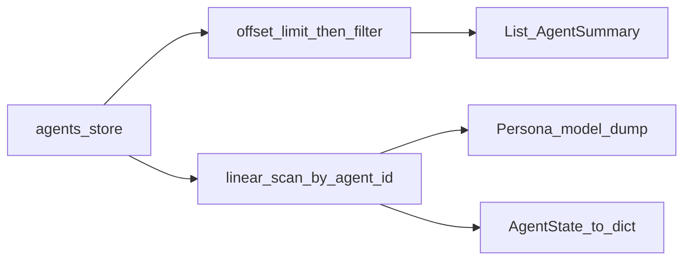

# Agents API

**Purpose:** List or fetch one synthetic agent from the in-memory [`agents_store`](../../api/state.py).

**Prerequisites:** `POST /population/generate` (non-empty store).

**Postman:** folder `agents`.

**Sample I/O:** [`api_details_input_output.txt`](../../api_details_input_output.txt) — `GET /agents` ~lines 43–452; `GET /agents/{id}` ~453–575 (trimmed in doc; full JSON in file).

---

## HTTP contract

| Method | Path | Query / path | Response model |
|--------|------|--------------|----------------|
| GET | `/agents` | `limit`, `offset`, optional `location`, `nationality` | `List[`[`AgentSummary`](../../api/schemas.py)`]` |
| GET | `/agents/{agent_id}` | path `agent_id`, optional **`debug`** (bool) | [`AgentDetail`](../../api/schemas.py) |

---

## GET `/agents` — request example

```http
GET /agents?limit=100&offset=0
GET /agents?limit=10&offset=0&location=Dubai%20Marina
```

---

## GET `/agents` — response example (trimmed)

Matches [`api_details_input_output.txt`](../../api_details_input_output.txt) list shape:

```json
[
  {
    "agent_id": "DXB_0000",
    "age": "18-24",
    "nationality": "Emirati",
    "income": "50k+",
    "location": "Dubai Marina",
    "occupation": "professional"
  }
]
```

---

## GET `/agents` — response field ledger

| Field | Type | Meaning | Formula / algorithm | Source |
|-------|------|---------|---------------------|--------|
| `agent_id` | string | Persona id | `persona.agent_id` | [`list_agents`](../../api/routes/agents.py) |
| `age` | string | Age band | `persona.age` | same |
| `nationality` | string | | `persona.nationality` | same |
| `income` | string | Income band | `persona.income` | same |
| `location` | string | District | `persona.location` | same |
| `occupation` | string | Job category | `persona.occupation` | same |

---

## Pagination + filter semantics (critical)

[`list_agents`](../../api/routes/agents.py):

```python
for a in agents_store[offset : offset + limit]:
    if location and p.location != location: continue
    if nationality and p.nationality != nationality: continue
```

**Slice first, then filter.** `limit` caps how many store entries are **scanned**, not how many matches you get. For “first 100 matching Dubai Marina”, you may need a larger window or full scan (not exposed today).

---

## GET `/agents/{agent_id}` — response structure

`AgentDetail` = `{ "agent_id", "persona", "state", "decision_profile" }`.

- `persona`: [`Persona.model_dump()`](../../population/personas.py) — full Pydantic persona JSON.
- `state`: [`AgentState.to_dict()`](../../agents/state.py) if present.
- `decision_profile`: **null** unless `GET /agents/{agent_id}?debug=true`. When set, a compact bundle for inspection: `latent` (12-d behavioral dict), `beliefs_summary`, `dominant_traits` (top-3 latent keys) — see [`get_agent`](../../api/routes/agents.py).

---

## `persona` nested ledger ([`Persona`](../../population/personas.py))

| JSON path | Type | Meaning |
|-----------|------|---------|
| `agent_id` | string | Unique id |
| `age` | string | Demographic band |
| `nationality` | string | |
| `income` | string | Income band |
| `location` | string | Area / district |
| `occupation` | string | Job type |
| `household_size` | string | e.g. `1`, `2`, `3-4`, `5+` |
| `family.spouse` | bool | |
| `family.children` | int | 0–8 |
| `mobility.car` | bool | |
| `mobility.metro_usage` | string | `rare` \| `occasional` \| `frequent` |
| `lifestyle.*` | float | Six coefficients in [0,1] ([`LifestyleCoefficients`](../../population/personas.py)) |
| `personal_anchors.*` | mixed | Cuisine, diet, hobby, work_schedule, health_focus, commute, `narrative_style`, `archetype` |
| `meta.*` | mixed | `synthesis_method`, `generation_seed`, `population_segment`, archetype cluster ids |
| `media_subscriptions` | string[] | Media source ids |

**Computation:** No API-side math — values were set at population synthesis and optionally updated by simulation.

---

## `state` nested ledger ([`AgentState.to_dict`](../../agents/state.py))

Serialized keys mirror `to_dict()` (subset of full dataclass; some fields are runtime-only and omitted from API JSON).

| JSON path | Meaning |
|-----------|---------|
| `agent_id` | Echo |
| `latent_state` | 12 behavioral dimensions → float (~[0,1]) via [`BehavioralLatentState`](../../agents/behavior.py) |
| `beliefs` | Serialized [`BeliefNetwork`](../../agents/belief_network.py) |
| `identity` | [`IdentityState`](../../agents/identity.py) snapshot |
| `last_answers` | question_id → last answer payload |
| `structured_memory` | Semantic memory map |
| `medium_term_memory` | List of compressed summary strings |
| `long_term_preferences` | Distilled preference floats |
| `dialogue_summary` | Compressed dialogue |
| `life_event_history` | Recent simulation life events |
| `social_trait_fraction` | Neighbor trait share ([`fraction_friends_with_trait`](../../social/influence.py)); legacy code may use property `friends_using_delivery` |
| `current_day` | Simulation day counter |
| `behavior_scores` | Same as `latent_state` map (legacy accessor) |
| `base_malleability`, `calcification` | Bias engine rigidity |
| `activation` | Per-topic activation map for cascades |
| `interaction_mode`, `recent_interaction_modes`, `recent_utterances` | Conversation / mode tracking |
| `turn_count`, `fatigue`, `emotional_state` | Turn fatigue and affect |
| `identity_version` | Identity revision counter |

**Tests:** [`tests/test_system_invariants.py`](../../tests/test_system_invariants.py), state-heavy survey tests under `tests/`.

---

## Execution trace

1. [`list_agents`](../../api/routes/agents.py) or [`get_agent`](../../api/routes/agents.py)
2. Read from global [`agents_store`](../../api/state.py)
3. Detail: `AgentDetail(persona=p.model_dump(), state=state.to_dict(), decision_profile=...)` where `decision_profile` is built only when `debug=true`.

**Tests:** behavior covered indirectly by population/survey tests; schema fields in [`api/schemas.py`](../../api/schemas.py).



---

## Errors

- **404** on `GET /agents/{id}` if id not found.

---

## Configuration

None specific to listing; persona shape depends on domain [`demographics.json`](../../config/demographics.py) at generation time.

---

## Known limitations

- No server-side sort; order is `agents_store` insertion order (population generation order).
- Filtering + pagination interaction (see above).

---

## Cross-links

- [Module: API](../modules/api.md), [Agents](../modules/agents.md)
