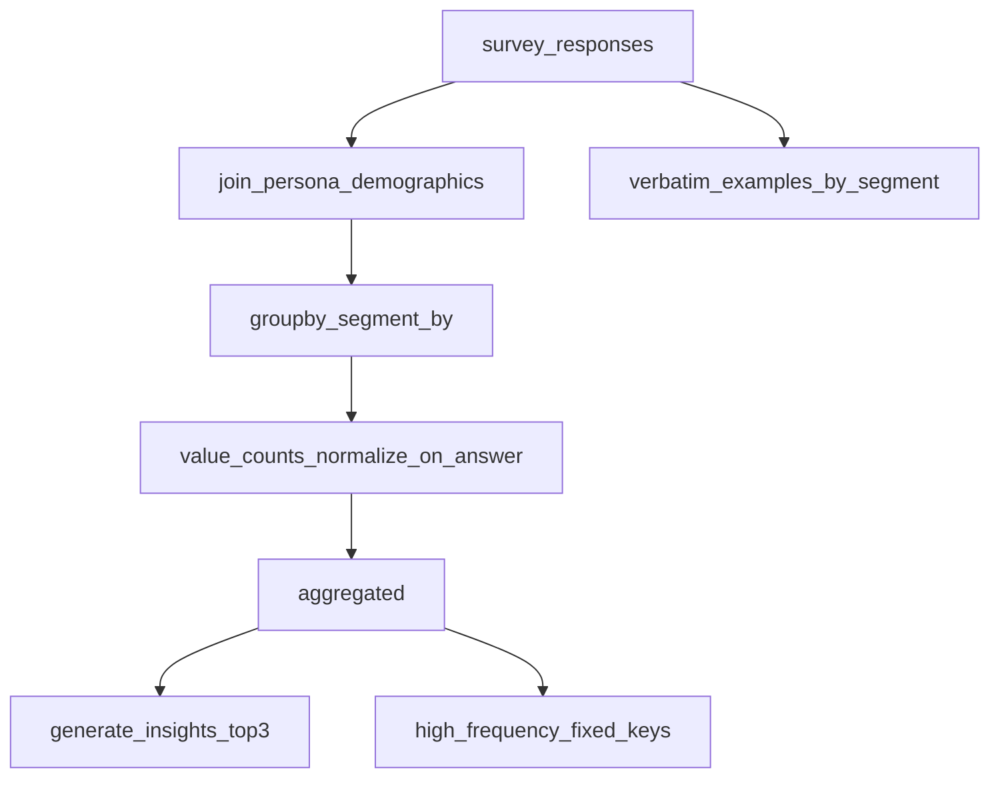

# Analytics API

**Purpose:** Segment-level **proportions of verbatim survey answers** plus auto-generated insight strings.

**Prerequisites:** `survey_id` in [`survey_results`](../../api/state.py); personas in [`agents_store`](../../api/state.py) for demographic join.

**Sample I/O:** [`api_details_input_output.txt`](../../api_details_input_output.txt) — `GET /analytics/...` ~8647–8738. That capture may use **narrative-level** keys; with current defaults (`answer_key=sampled_option_canonical`) distributions align to discrete options instead.

---

## HTTP contract

| Method | Path | Query | Response |
|--------|------|-------|----------|
| GET | `/analytics/{survey_id}` | `segment_by` (default `location`), **`answer_key`** (default `sampled_option_canonical`) | JSON dict (see ledger; not the `AnalyticsResponse` model alone) |

`answer_key` must be a key present on each response item: `sampled_option_canonical` \| `sampled_option` \| `answer` ([`get_analytics`](../../api/routes/analytics.py)).

### Request example

```http
GET /analytics/{{survey_id}}?segment_by=location
GET /analytics/{{survey_id}}?segment_by=location&answer_key=answer
```

---

## Response example (structure only)

With default `answer_key=sampled_option_canonical`, inner keys are **discrete options** (when that field is set on responses):

```json
{
  "survey_id": "…",
  "segment_by": "location",
  "answer_key": "sampled_option_canonical",
  "aggregated": {
    "Dubai Marina": { "daily": 0.35, "3-4 per week": 0.28 }
  },
  "verbatim_examples": {
    "Dubai Marina": ["I usually order once a day…", "…"]
  },
  "insights": ["location Dubai Marina: …"]
}
```

With `answer_key=answer`, keys are **full narrative strings** (high cardinality).

---

## Response field ledger

| Field | Type | Meaning | Formula / algorithm | Source |
|-------|------|---------|---------------------|--------|
| `survey_id` | string | Echo | Path param | [`get_analytics`](../../api/routes/analytics.py) |
| `segment_by` | string | Echo | Query, default `location` | same |
| `answer_key` | string | Echo | Query, default `sampled_option_canonical` | same |
| `aggregated` | object | Segment → (value of `answer_key` → proportion) | `groupby(segment_by)` then `value_counts(normalize=True)` on `answer_key` column | [`aggregate_with_personas`](../../analytics/aggregator.py) |
| `verbatim_examples` | object | Segment → **list** of up to 3 narrative `answer` strings (qualitative samples) | [`verbatim_examples_by_segment`](../../analytics/aggregator.py); empty `{}` if no personas | same |
| `insights` | string[] | Human-readable lines | [`generate_insights`](../../analytics/insights.py) + optional `delivery_frequency_insight` | same |

---

## Aggregation (`answer_key`)

[`aggregate_with_personas`](../../analytics/aggregator.py):

1. Join each response with `Persona` by `agent_id` → add `location` / `income` / `nationality` / `age` columns.
2. Drop rows missing `segment_by` or `answer_key`.
3. `DataFrame.groupby(segment_by)` → column **`answer_key`** **`value_counts(normalize=True)`**.

- Default **`sampled_option_canonical`**: inner keys are discrete options (aligned with the decision layer).
- **`answer_key=answer`**: inner keys are **full narrative strings** — high cardinality; two agents with the same meaning but different wording appear as **two buckets** (as in older samples using `answer`).

---

## `generate_insights`

For each segment: sort `(answer, proportion)` descending, take **top 3**, format `"{value}: {p:.0%}"`, prefix with `"{segment_by} {segment_label}:"`.

---

## `delivery_frequency_insight` / `high_frequency_insight`

[`high_frequency_insight`](../../analytics/insights.py) sums proportions for **fixed keys**:

`["3-4 per week", "daily", "multiple per day", "often", "very often"]`

over each segment’s distribution.

**Why the sample shows nonsense** (e.g. *"High frequency in Al Barsha (0%); lower in Al Barsha (0%)."* in [`api_details_input_output.txt`](../../api_details_input_output.txt)):

- Aggregated keys are **full sentences**, not those short labels — so `dist.get(k, 0)` is always **0** for every segment.
- The helper still picks `best`/`worst` segments; when all `high_freq` are 0 you get **0% vs 0%** copy.

**Operational guidance:** Use default `answer_key=sampled_option_canonical` (or `sampled_option`) for distributions aligned with the survey decision layer. Use `answer_key=answer` only when you want narrative-level buckets.

---

## Worked toy example (2 segments, synthetic)

| segment | answer | count |
|---------|--------|-------|
| A | "often" | 2 |
| A | "rarely" | 2 |
| B | "often" | 1 |
| B | "often" | 2 |

Normalized:

- `aggregated["A"]` → `{"often": 0.5, "rarely": 0.5}`
- `aggregated["B"]` → `{"often": 1.0}`

Insights: top-3 lines per segment; `high_frequency_insight` only non-zero if keys match the fixed list above.

---

## Execution trace

1. [`get_analytics`](../../api/routes/analytics.py)
2. `responses` = `survey_results[survey_id]["responses"]`
3. `aggregate_with_personas(..., segment_by=..., answer_key=query.answer_key)` (defaults `sampled_option_canonical`)
4. `verbatim_examples_by_segment(...)` when personas exist
5. `generate_insights` + `delivery_frequency_insight` (try/except wrapper)



---

## Errors

- **404** if `survey_id` not in `survey_results`.
- If `agents_store` has no personas: `aggregated={}`, `insights=[]`.

---

## Cross-links

- [Module: Analytics](../modules/analytics.md)
- [`tests/test_docs_examples.py`](../../tests/test_docs_examples.py) — Pydantic checks for curated `docs/examples/*.json`
