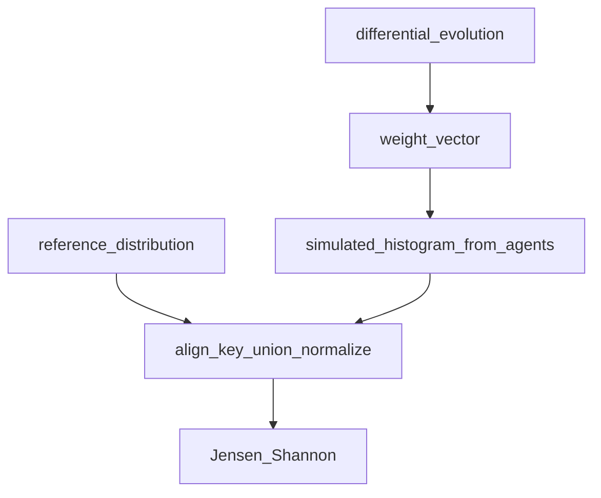

# Calibration API

**Purpose:** **Upload** real response strings to build an empirical reference distribution; **fit** factor weights for one survey question against a reference; **batch-fit** weights for multiple questions. Uses live [`agents_store`](../../api/state.py) as the simulation substrate for `/fit` and `/auto-weights`.

**Prerequisites:** Non-empty **`agents_store`** for `POST /calibration/fit` and `POST /calibration/auto-weights` (400 otherwise). **`POST /calibration/upload-data`** needs no population.

**Postman:** folder `calibration`.

**Sample I/O:** There is **no** `/calibration/*` block in [`api_details_input_output.txt`](../../api_details_input_output.txt) (file ends after Discovery ~9068). Use the **minimal JSON examples** below and the code anchors when validating payloads.

---

## HTTP contract

| Method | Path | Body | Response |
|--------|------|------|----------|
| POST | `/calibration/upload-data` | [`UploadDataRequest`](../../api/routes/calibration.py) | JSON (ledger below) |
| POST | `/calibration/fit` | [`FitRequest`](../../api/routes/calibration.py) | JSON (ledger below) |
| POST | `/calibration/auto-weights` | [`AutoWeightsRequest`](../../api/routes/calibration.py) | JSON (ledger below) |

---

## POST `/calibration/upload-data`

### Request example

```json
{
  "question": "How often do you order?",
  "responses": ["often", "often", "rarely", "sometimes"],
  "demographics": null
}
```

### Response example

```json
{
  "question": "How often do you order?",
  "n_responses": 4,
  "reference_distribution": {
    "often": 0.5,
    "rarely": 0.25,
    "sometimes": 0.25
  }
}
```

### Response field ledger

| Field | Meaning | Formula / source | Code |
|-------|---------|------------------|------|
| `question` | Echo | Request field | [`upload_real_data`](../../api/routes/calibration.py) |
| `n_responses` | Row count | `len(responses)` | [`RealSurveyData`](../../calibration/data_loader.py) |
| `reference_distribution` | Normalized histogram of **verbatim** answers | `count(option)/n`, rounded (implementation in loader) | [`RealSurveyData.to_reference_distribution`](../../calibration/data_loader.py) |

**Optional `demographics`:** Parallel list of demographic dicts per row — stored on [`RealSurveyData`](../../calibration/data_loader.py) for future segmentation (not applied in the simple reference dict returned today).

---

## POST `/calibration/fit`

### Request example

```json
{
  "question": "How often do you order delivery?",
  "reference_distribution": {
    "never": 0.1,
    "rarely": 0.2,
    "sometimes": 0.3,
    "often": 0.25,
    "very often": 0.15
  },
  "demographics_cols": null,
  "n_iterations": 50
}
```

### Response field ledger

| Field | Meaning | Formula / source | Code |
|-------|---------|------------------|------|
| `question` | Echo | Same as request | [`fit_calibration`](../../api/routes/calibration.py) |
| `learned_weights` | Per-factor weights | DE best vector → dict over **`FACTOR_NAMES`** | [`FactorWeightLearner.learn_weights_for_question`](../../calibration/auto_weights.py) |
| `interpretation` | Human-readable weight bands | Per-key string from route `_interpret_weight` (strong/moderate/light/minimal influence) | same route |
| `best_loss` | Final Jensen–Shannon distance | `scipy.spatial.distance.jensenshannon(p_sim, p_ref)` on **aligned union of keys** (normalized) | same |
| `converged` | Optimizer success | `differential_evolution` `result.success` | same |
| `n_iterations` | Iterations used | From `WeightLearningResult.n_iterations` | same |
| `calibration_provenance` | Metadata | `seed` from learner, `persisted_runtime_overrides: true` when weights stored via [`set_calibrated_weights`](../../config/calibrated_weights.py) | same route |

### Objective (detailed)

[`FactorWeightLearner.learn_weights_for_question`](../../calibration/auto_weights.py):

1. Build `simulate_fn` (default [`_build_default_simulator`](../../calibration/auto_weights.py)): for up to **`min(100, len(agents))`** agents, [`perceive`](../../agents/perception.py) + [`detect_question_model`](../../agents/perception.py), patch `factor_weights`, then [`compute_distribution`](../../agents/decision.py) + [`sample_from_distribution`](../../agents/decision.py); tally **sampled option** strings.
2. **Loss** = Jensen–Shannon between simulated histogram and `reference_distribution` (missing keys → 0 mass).
3. **Optimizer:** [`differential_evolution`](https://docs.scipy.org/doc/scipy/reference/generated/scipy.optimize.differential_evolution.html), bounds **`(-0.5, 1.0)`** per factor in [`FACTOR_NAMES`](../../calibration/auto_weights.py): `personality`, `income`, `social`, `location`, `memory`, `behavioral`, `belief`.



### Worked mini-example (loss intuition)

Reference `p = (0.5, 0.5)` on `{A,B}`. Simulator returns `(0.9, 0.1)` before normalize → after normalize same shape. **JS(p,q)** is small if histograms match, **~0.7+** scale when disjoint — the DE search minimizes that scalar.

---

## POST `/calibration/auto-weights`

### Request example

```json
{
  "questions": [
    "How often do you order delivery?",
    "What matters most when choosing a platform?"
  ],
  "reference_distributions": {
    "How often do you order delivery?": {
      "never": 0.05,
      "rarely": 0.15,
      "sometimes": 0.35,
      "often": 0.3,
      "very often": 0.15
    }
  },
  "n_iterations": 50,
  "seed": 42
}
```

### Response field ledger

| Field | Meaning | Formula / source | Code |
|-------|---------|------------------|------|
| `overall_loss` | Scalar summary | **Average** of `best_loss` over questions that had a matching reference key | [`learn_weights`](../../calibration/auto_weights.py) → `avg_loss = total_loss / max(1, len(results))` |
| `calibration_provenance` | Metadata | `n_iterations`, `seed` from request; `persisted_runtime_overrides: true` after each question’s weights are stored | [`auto_weights` route](../../api/routes/calibration.py) |
| `results` | Per-question outcomes | One object per successfully learned question | same |
| `results[].question` | Echo | From loop variable | same |
| `results[].learned_weights` | Dict | Same as `/fit` | same |
| `results[].interpretation` | Human-readable bands | `_interpret_weight` per factor | same route |
| `results[].best_loss` | float | Per-question JS minimum | same |
| `results[].converged` | bool | DE success flag | same |

**Runtime persistence:** After each question, the route resolves `question_model_key` via [`detect_question_model(perceive(question))`](../../agents/perception.py) and calls [`set_calibrated_weights`](../../config/calibrated_weights.py). [`resolve_question_model` / factor loading](../../config/question_models.py) reads those overrides for subsequent `compute_distribution` calls in-process (lost on API restart).

**Skipped questions:** If `reference_distributions` has **no** entry for a question string, a **warning** is logged and that question is omitted from `results` (does not inflate the average denominator beyond `len(results)`).

---

## Applying learned weights

**In-process:** `/fit` and `/auto-weights` already persist to [`config/calibrated_weights.py`](../../config/calibrated_weights.py) as above. **On disk / domain JSON:** exporting into `question_model_overrides` remains a separate ops step if you need durability across restarts. Patched weights must align with the **same** `detect_question_model` resolution as in the simulator loop ([`_build_default_simulator`](../../calibration/auto_weights.py)).

---

## Errors

| Condition | HTTP |
|-----------|------|
| `/fit` or `/auto-weights` with empty `agents_store` | **400** `"No population loaded."` |

---

## Known limitations / caveats

- Simulator sample size **≤ 100** agents; noisy loss for small cohorts.
- Reference keys must match **simulated option labels** from the question model scale; otherwise JS compares mismatched supports (similar to evaluation `distribution_validation` scale mismatch).
- `demographics_cols` on `FitRequest` is reserved for future segmented fitting.

---

## Cross-links

- [Module: Calibration](../modules/calibration.md)
- [Config: calibrated_weights + question_models](../modules/config.md)
- [Evaluation API](evaluation.md) — comparing runs to `reference_distribution`
- [`tests/test_docs_examples.py`](../../tests/test_docs_examples.py) — Pydantic checks for curated JSON under `docs/examples/`
