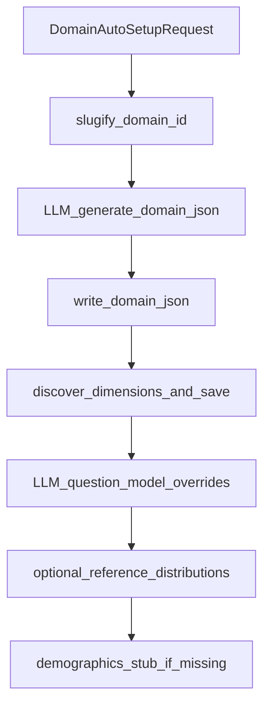
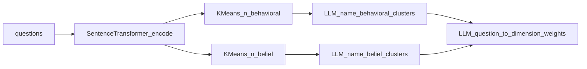

# Discovery API

**Purpose:** Bootstrap a **new domain folder** on disk (`data/domains/<id>/`) via LLM-assisted config, and/or **discover behavioral & belief dimensions** from question text (embeddings + clustering + LLM naming and question→dimension weights).

**Prerequisites:** LLM client configured ([`llm/client.py`](../../llm/client.py)); write access to `data/domains/`. **No population** required for these routes.

**Postman:** folder `discovery`.

**Sample I/O:** [`api_details_input_output.txt`](../../api_details_input_output.txt) — `Discovery –` block **~8998–9068** (`POST /discovery/domains/auto-setup`, `POST /discovery/dimensions`). The sample shows truncated `behavioral`/`belief` lists (two items each) and a `question_to_dimension` map with float weights.

---

## HTTP contract

| Method | Path | Body model | Response model |
|--------|------|------------|----------------|
| POST | `/discovery/domains/auto-setup` | [`DomainAutoSetupRequest`](../../api/routes/discovery.py) | [`DomainAutoSetupResponse`](../../api/routes/discovery.py) |
| POST | `/discovery/dimensions` | [`DimensionDiscoveryRequest`](../../api/routes/discovery.py) | [`DimensionDiscoveryResponse`](../../api/routes/discovery.py) |

---

## POST `/discovery/domains/auto-setup`

### Request example (matches sample file)

```json
{
  "domain_name": "food_delivery",
  "description": "Food delivery and preferences",
  "sample_questions": ["How often do you order delivery?"],
  "city_name": "Dubai",
  "currency": "USD",
  "reference_data": null
}
```

### Response example

```json
{
  "domain_id": "food_delivery",
  "message": "Domain 'food_delivery' created at data/domains/food_delivery/"
}
```

### Response field ledger

| Field | Type | Meaning | Formula / algorithm | Code |
|-------|------|---------|---------------------|------|
| `domain_id` | string | Folder name under `data/domains/` | `re.sub(r'[^a-z0-9_]', '_', domain_name.lower()).strip('_')` or `"custom"` if empty | [`DomainAutoSetup.setup_domain`](../../discovery/domain_setup.py) |
| `message` | string | Human confirmation | f-string with `domain_id` | [`auto_setup_domain`](../../api/routes/discovery.py) |

### Side effects (on disk)

Executed inside [`setup_domain`](../../discovery/domain_setup.py) (numbered):

1. Ensure `data/domains/{domain_id}/` exists.
2. **LLM** [`_generate_config_via_llm`](../../discovery/domain_setup.py) → merge into base skeleton → write **`domain.json`**.
3. [`_discover_dimensions`](../../discovery/domain_setup.py): [`DimensionDiscovery.discover_dimensions`](../../discovery/dimensions.py) on `sample_questions`; if non-empty → [`save_discovered_dimensions`](../../discovery/dimensions.py) → **`discovered_dimensions.json`**; may set `discovered_dimensions: true` in config and rewrite `domain.json`.
4. [`_generate_question_models`](../../discovery/domain_setup.py) → optional **`question_model_overrides`** in `domain.json`.
5. If `reference_data` set → **`reference_distributions.json`**.
6. If **`demographics.json`** missing → write **stub marginals** (generic age/nationality/income/location/occupation).



---

## POST `/discovery/dimensions`

### Request example (matches sample file)

```json
{
  "questions": [
    "How often do you use delivery?",
    "What influences your choice?"
  ],
  "n_behavioral": 12,
  "n_belief": 7,
  "domain_id": null,
  "save": false
}
```

### Response shape (ledger + sample alignment)

Top-level keys mirror [`DiscoveredDimensions.to_dict`](../../discovery/dimensions.py), plus API-only **`saved`**.

| Field | Type | Meaning | Formula / algorithm | Code |
|-------|------|---------|---------------------|------|
| `behavioral` | object[] | Named behavioral dimensions | Embed all `questions` → **KMeans** with `k = min(n_behavioral, n)` → per cluster **LLM** name/description (fallback `behavioral_dim_{cid}` if LLM missing) | [`DimensionDiscovery.discover_dimensions`](../../discovery/dimensions.py), [`_cluster`](../../discovery/dimensions.py), [`_name_clusters_via_llm`](../../discovery/dimensions.py) |
| `behavioral[].name` | string | Snake-ish label from LLM JSON | Parsed `name` field | same |
| `behavioral[].description` | string | One-sentence description | Parsed `description` | same |
| `behavioral[].representative_questions` | string[] | Up to 5 questions in cluster | Cluster membership | same |
| `belief` | object[] | Parallel pipeline with `kind="belief"` | Second **KMeans** with `k = min(n_belief, n)` + LLM naming | same |
| `belief[].*` | — | Same shape as behavioral | — | — |
| `question_to_dimension` | object | Question text → { dimension_name → weight } | **LLM** relevance scores in `[-1,1]`; only `\|w\| ≥ 0.1` kept; empty if no LLM | [`_assign_weights_via_llm`](../../discovery/dimensions.py) |
| `saved` | bool | Persisted to disk | `true` iff `req.save && req.domain_id` then [`save_discovered_dimensions(domain_id, result)`](../../discovery/dimensions.py) | [`discover_dimensions` route](../../api/routes/discovery.py) |

**Note:** Behavioral and belief pipelines both cluster the **same** question embedding matrix; they are **two independent clusterings** (different `k`), not a partition. Duplicate or similar names across `behavioral` and `belief` can appear (as in the sample file).

### Execution trace (route → callees)

1. [`api/routes/discovery.py:discover_dimensions`](../../api/routes/discovery.py)
2. [`DimensionDiscovery.discover_dimensions`](../../discovery/dimensions.py)
3. [`_embed`](../../discovery/dimensions.py) — `SentenceTransformer` default **`all-MiniLM-L6-v2`**
4. [`_cluster`](../../discovery/dimensions.py) — sklearn `KMeans(n_clusters, random_state=42, n_init=10)`
5. [`_name_clusters_via_llm`](../../discovery/dimensions.py) ×2 (behavioral, belief)
6. [`_assign_weights_via_llm`](../../discovery/dimensions.py)
7. Optional [`save_discovered_dimensions`](../../discovery/dimensions.py) → `data/domains/{domain_id}/discovered_dimensions.json`



---

## Worked mini-example (cluster count cap)

Three questions, `n_behavioral=12`: `_cluster` uses `n_clusters = min(12, 3) = 3` (see [`_cluster`](../../discovery/dimensions.py)). `_name_clusters_via_llm` is called with `n_clusters` = `min(n_behavioral, len(questions))` = 3 for labeling. If `len(questions)==1`, KMeans receives `n_clusters=1`.

---

## Configuration & data files

- Embedding model: constructor arg on [`DimensionDiscovery`](../../discovery/dimensions.py) (default `all-MiniLM-L6-v2`).
- Persisted discovery (API or auto-setup): [`data/domains/<domain_id>/discovered_dimensions.json`](../../discovery/dimensions.py) via [`save_discovered_dimensions`](../../discovery/dimensions.py).
- Runtime merge of discovered names: [`get_active_dimension_names`](../../discovery/dimensions.py) appends extras to core lists from [`agents.behavior`](../../agents/behavior.py) and [`agents.belief_network`](../../agents/belief_network.py).

---

## Known limitations / caveats

- Dimension names and `question_to_dimension` weights are **LLM-generated**; review before production.
- Without `sentence-transformers` / sklearn / LLM, discovery **degrades** (placeholder cluster names, empty weights map).
- **`save: true`** without **`domain_id`** does not write files (route requires both).

---

## Cross-links

- [Module: Discovery](../modules/discovery.md)
