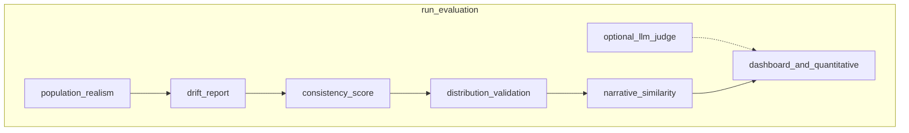

# Evaluation API

**Purpose:** Run population realism, drift, consistency, distribution fit, narrative similarity, optional LLM judge; export JSON report.

**Prerequisites:** `survey_id` in [`survey_results`](../../api/state.py); non-empty [`agents_store`](../../api/state.py).

**Sample I/O:** [`api_details_input_output.txt`](../../api_details_input_output.txt) — `POST /evaluate/...` ~8741–8990; lines ~8992–8996 are a minimal GET sample (the live route returns the **full exported report JSON** when `evaluation_report_{id}.json` exists). The sample shows **distribution_validation** failure when `sampled_option` labels (`multiple per day`, …) are compared to **generic_frequency** reference (`never`, `rarely`, `sometimes`, `often`, `very often`).

---

## HTTP contract

| Method | Path | Body | Response |
|--------|------|------|----------|
| POST | `/evaluate/{survey_id}` | [`EvaluateRequest`](../../api/schemas.py) | [`EvaluationReportResponse`](../../api/schemas.py) |
| GET | `/evaluate/{evaluation_id}/report` | — | Parsed **`evaluation_report_{evaluation_id}.json`** (same structure as export; not the Pydantic response wrapper) |

### Request example (defaults)

```json
{
  "run_judge": false,
  "judge_sample": 20,
  "realism_threshold": 0.85,
  "drift_threshold": 0.3,
  "run_similarity": true,
  "similarity_threshold": 0.9,
  "reference_distribution": null,
  "question_model_key": null
}
```

With explicit reference (matches your survey option labels — avoids generic_frequency mismatch):

```json
{
  "run_judge": false,
  "run_similarity": true,
  "reference_distribution": {
    "rarely": 0.05,
    "1-2 per week": 0.15,
    "3-4 per week": 0.25,
    "daily": 0.30,
    "multiple per day": 0.25
  }
}
```

Or use **`question_model_key`** so [`validate_survey_distribution`](../../evaluation/distribution_validation.py) loads domain reference via [`get_reference_distribution`](../../config/reference_distributions.py) when `reference_distribution` is omitted.

| Field | Role |
|-------|------|
| `reference_distribution` | Optional observed target histogram (option → proportion). Passed to `run_evaluation` for distribution validation. |
| `question_model_key` | When set and reference omitted, load reference from domain/registry for that model key. |

---

## Execution trace

1. [`evaluate_survey`](../../api/routes/evaluation.py) loads `responses` from `survey_results[survey_id]["responses"]`.
2. `personas` = personas from `agents_store`.
3. [`run_evaluation`](../../evaluation/report.py) (async) with `reference_distribution` and `question_model_key` from body ([`evaluate_survey`](../../api/routes/evaluation.py)).
4. [`export_evaluation_report`](../../evaluation/report.py) → `evaluation_report_{survey_id}.json` on disk.

**Tests:** [`tests/test_distribution_validation.py`](../../tests/test_distribution_validation.py), [`tests/test_system_invariants.py`](../../tests/test_system_invariants.py).



---

## Top-level response field ledger

| Field | Meaning |
|-------|---------|
| `population_realism` | Dict from [`compute_realism_report`](../../evaluation/realism.py) |
| `drift` | Dict from [`drift_report`](../../evaluation/drift.py) |
| `consistency_score` | Float from [`consistency_score_from_responses`](../../evaluation/consistency.py) |
| `consistency_valid` | Bool — whether enough cross-question data existed for a meaningful consistency score ([`EvaluationReportResponse`](../../api/schemas.py)). |
| `distribution_validation` | Dict from [`validate_survey_distribution`](../../evaluation/distribution_validation.py) |
| `narrative_similarity` | Dict from [`compute_narrative_similarity`](../../evaluation/similarity.py) or empty |
| `llm_judge` | Dict from [`judge_responses_batch`](../../evaluation/judge.py) if `run_judge`, else null |
| `dashboard` | Six scalar metrics for quick view |
| `quantitative_metrics` | Each metric + target string + `passed` |
| `summary` | Short pass/fail rollup |

---

## `population_realism` (nested)

| Key | Formula / source |
|-----|------------------|
| `population_realism_score` | Same mean `(1 - JS)` over demographic marginals as post-gen validation ([`validate_population`](../../population/validator.py)) |
| `passed` | `score >= realism_threshold` |
| `threshold` | Request body echo |
| `per_attribute` | Per marginal `1 - JS` + `multimodality` + `segment_entropy` |

---

## `drift` (nested)

| Key | Formula |
|-----|---------|
| `drifted_agent_ids` | Agents with `|baseline - inferred_current| > drift_threshold` ([`detect_drift`](../../evaluation/drift.py)) |
| `count` | `len(drifted_agent_ids)` |
| `rate` | `count / len(personas)` (sample: 9/50 = 0.18) |
| `threshold` | Request echo |
| `per_agent_magnitude` | Map agent_id → `abs(primary_service_preference - infer_current_behavior(...))` |
| `auto_reset_count` | 0 unless API extended with auto_reset |

**`infer_current_behavior`:** scans `response_histories` text for keywords in `_ANSWER_TO_BEHAVIOR` ([`evaluation/drift.py`](../../evaluation/drift.py)).

---

## `consistency_score`

- If fewer than **2** distinct `question_id` in histories → **1.0**.
- Else pairwise [`check_frequency_consistency`](../../evaluation/consistency.py) on `sampled_option` fallback `answer` across questions; **average** pairwise rate. Sample file shows **1.0** with a single survey (or no conflicting pairs).

---

## `distribution_validation` (nested)

| Key | Meaning |
|-----|---------|
| `observed_distribution` | Counts of `sampled_option` / total ([`aggregate_survey_distribution`](../../evaluation/distribution_validation.py), default key `sampled_option`) |
| `js_divergence`, `js_similarity` | `jensenshannon(obs, ref)`; similarity = `1 - js` |
| `chi_square_p_value`, `chi_square_significant` | Chi-square on scaled counts vs reference |
| `per_option` | Per key: `observed`, `reference`, `diff` |
| `passed` | `js_similarity >= 0.85` |
| `n_responses` | `len(survey_responses)` |

**Default reference:** When the route does not pass `reference`, [`DEFAULT_REFERENCE`](../../evaluation/distribution_validation.py) = `get_reference_distribution("generic_frequency")` — labels **never / rarely / sometimes / often / very often**. Food-delivery **`sampled_option`** labels (`multiple per day`, `3-4 per week`, …) **do not match**, so `reference` shows 0 for those keys and similarity collapses (as in the sample file). **Not a bug in JS math** — a **scale mismatch** to fix via API wiring or domain reference registry.

---

## `narrative_similarity` (nested)

Built from narratives where `answer != sampled_option` and non-empty ([`run_evaluation`](../../evaluation/report.py)).

| Key | Meaning |
|-----|---------|
| `duplicate_rate` | `duplicate_pairs / total_pairs` (upper triangle, cosine > threshold) |
| `duplicate_pairs`, `total_pairs` | Pair counts |
| `mean_similarity`, `max_similarity` | Stats over upper triangle |
| `flagged_pairs` | Sample of offending index pairs |

Uses [`SentenceTransformer`](../../evaluation/similarity.py) + sklearn cosine similarity.

---

## `llm_judge`

If `run_judge`: [`judge_responses_batch`](../../evaluation/judge.py) returns `{ scores, average, n_judged }`. If false: **null** in sample.

**Dashboard caveat:** [`run_evaluation`](../../evaluation/report.py) computes `mean_judge_score` from a **list** shape; actual return is a **dict**, so **`mean_judge_score` may stay 0.0** in `dashboard` even when judge ran — see code; full scores still under `llm_judge` when enabled.

---

## `dashboard` and `quantitative_metrics`

[`QUALITY_TARGETS`](../../evaluation/report.py) define thresholds:

| Dashboard key | Source | Target (quantitative_metrics) |
|---------------|--------|-------------------------------|
| `duplicate_narrative_rate` | narrative_similarity | `<0.05` |
| `persona_realism_score` | population_realism | `>0.90` |
| `distribution_similarity` | distribution_validation `js_similarity` | `>0.85` |
| `consistency_score` | consistency stage | `>0.90` |
| `drift_rate` | drift `rate` | `<0.10` |
| `mean_judge_score` | judge (see caveat) | `>3.50` |

---

## `summary` (nested)

| Key | Meaning |
|-----|---------|
| `realism_passed`, `realism_score` | From population_realism |
| `drift_count`, `drift_rate` | From drift |
| `distribution_passed` | From distribution_validation |
| `duplicate_narrative_rate` | Echo from similarity |
| `all_targets_passed` | AND of `quantitative_metrics[*].passed` |

---

## GET `/evaluate/{evaluation_id}/report`

Loads **`evaluation_report_{evaluation_id}.json`** from the server process **working directory** ([`get_evaluation_report`](../../api/routes/evaluation.py)). **`evaluation_id` is typically the same string as `survey_id`** used when `POST /evaluate/{survey_id}` wrote the file. Returns **404** if the file is missing.

The JSON is whatever [`export_evaluation_report`](../../evaluation/report.py) wrote (timestamp, `system_info`, report sections), not the `EvaluationReportResponse` envelope returned by POST.

---

## File export

Path: **`evaluation_report_{survey_id}.json`** (process working directory). Contents from [`export_evaluation_report`](../../evaluation/report.py): timestamp, `system_info`, trimmed sections.

---

## Cross-links

- [Module: Evaluation](../modules/evaluation.md)
- [Examples: evaluate request + trimmed report](../examples/evaluate-request-with-reference.json), [`evaluate-report-trimmed.json`](../examples/evaluate-report-trimmed.json)
