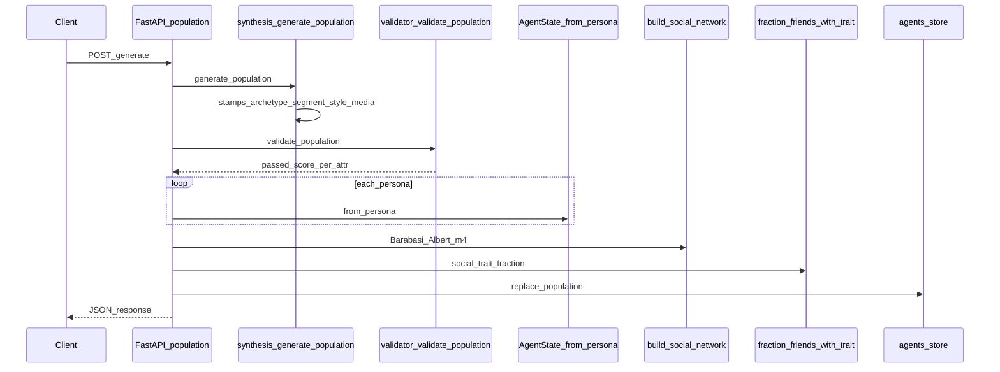
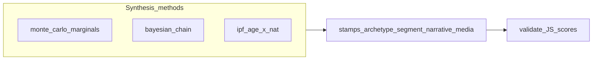

# Population API

**Purpose:** Create a synthetic cohort matching domain demographics, validate marginal fit, attach [`AgentState`](../../agents/state.py), build a social graph, and replace the process-global population.

**Prerequisites:** Active domain with `demographics.json` (via [`config/domain.py`](../../config/domain.py) / [`get_demographics()`](../../config/demographics.py)).

**Postman:** folder `population` → `POST /population/generate`.

**Sample I/O:** [`api_details_input_output.txt`](../../api_details_input_output.txt) — `Population –` / `POST .../population/generate` **~6–41** (request + output keys match the ledger below, including `segment_distribution` counts).

---

## HTTP contract

| Method | Path | Request model | Response |
|--------|------|---------------|----------|
| **POST** | `/population/generate` | [`GeneratePopulationRequest`](../../api/schemas.py) | JSON dict (see below) |

---

## Request body (`GeneratePopulationRequest`)

| Field | Type | Default | Constraints | Purpose |
|-------|------|---------|-------------|---------|
| `n` | int | 500 | Schema 10–10000; route rejects `n > 10000` with 400 | Number of personas. |
| `method` | string | `"bayesian"` | `monte_carlo` \| `bayesian` \| `ipf` | Synthesis algorithm (see [Synthesis methods](#synthesis-methods)). |
| `id_prefix` | string | `"DXB"` | any | Prefix for `agent_id` (e.g. `DXB_0000`). |
| `seed` | int \| null | null | optional | RNG seed for reproducibility where supported. |

### Example request

```json
{
  "n": 50,
  "method": "bayesian",
  "id_prefix": "DXB",
  "seed": 42
}
```

---

## Response body (200)

### Response field ledger

| Field | Type | Meaning | Formula / algorithm | Code |
|-------|------|---------|---------------------|------|
| `n` | int | Count returned | `len(personas)` | [`generate_population_endpoint`](../../api/routes/population.py) |
| `method` | string | Echo | Request body passthrough | same |
| `realism_passed` | bool | Gate vs threshold | `realism_score >= settings.population_realism_threshold` | [`validate_population`](../../population/validator.py) + route |
| `realism_score` | float | Mean marginal fit | Mean of `per_attribute[k]` for `k` ∈ {age, nationality, income, location, household_size, occupation} only | [`validate_population`](../../population/validator.py) |
| `per_attribute.*` | float | Per-marginal similarity | For each demographic marginal: `1.0 - JS(target, empirical)` | [`jensen_shannon_divergence`](../../population/validator.py) |
| `per_attribute.multimodality` | float | Latent multimodality | GMM BIC ratio score in `[0,1]`; `0` if `n<30` or no sklearn | [`multimodality_score`](../../population/validator.py) |
| `per_attribute.segment_entropy` | float | Spread of segments | Shannon entropy (natural log) of segment proportion vector | [`segment_distribution`](../../population/validator.py) + `scipy.stats.entropy` |
| `segment_distribution` | object | Segment counts | `Counter(population_segment)` → counts (not proportions) | Route; segments from [`_stamp_segments`](../../population/synthesis.py) |

**Jensen–Shannon (implementation):** [`_align_distributions`](../../population/validator.py) builds sorted union of keys, normalizes both vectors, then `scipy.spatial.distance.jensenshannon(p, q)` (default base = e; value in ~[0, 1]). Stored diagnostic is `1.0 - js` per attribute.

**`realism_score` explicitly excludes** `multimodality` and `segment_entropy` from the mean (see [`validate_population`](../../population/validator.py) loop).

### Example response

```json
{
  "n": 50,
  "method": "bayesian",
  "realism_passed": true,
  "realism_score": 0.9118,
  "per_attribute": {
    "age": 0.9177,
    "nationality": 0.8807,
    "income": 0.9048,
    "location": 0.8748,
    "household_size": 0.9535,
    "occupation": 0.9393,
    "multimodality": 0.0,
    "segment_entropy": 1.6697
  },
  "segment_distribution": {
    "health_premium": 6,
    "budget_worker": 15
  }
}
```

---

## Synthesis methods

All paths end in [`generate_population`](../../population/synthesis.py), which calls method-specific generators then **stamps** archetypes, segments, narrative styles, and media subscriptions.

| Method | Function | What it does |
|--------|----------|--------------|
| `monte_carlo` | [`generate_monte_carlo`](../../population/synthesis.py) | Independent draws from **marginals** only (`age`, `nationality`, `income`, `location` marginal, `household_size` conditional on age via `HOUSEHOLD_GIVEN_AGE`, `occupation` marginal). No cross-attribute joint beyond household/family CPT. |
| `bayesian` | [`generate_bayesian`](../../population/synthesis.py) | **Chain:** nationality → `income_given_nationality` → `location_given_income` → household (age-conditional) → `occupation_given_nationality`. Uses [`_noisy_weighted_choice`](../../population/synthesis.py) on categoricals. |
| `ipf` | [`generate_ipf`](../../population/synthesis.py) | [`_ipf_2d`](../../population/synthesis.py) fits **age × nationality** joint to both marginals; sample `(age, nationality)` from joint; fill rest with same Bayesian chain as above. |

Shared post-processing for every persona: family from [`_family_from_household`](../../population/synthesis.py) (CPT + optional [`cultural_family_multiplier`](../../config/domain.py)), mobility from [`_mobility_from_location`](../../population/synthesis.py), lifestyle from [`_lifestyle_from_demographics`](../../population/synthesis.py), anchors from [`_personal_anchors_from_demographics`](../../population/synthesis.py).

---

## Post-synthesis stamps (in order)

| Step | Function | Inputs → effect |
|------|----------|-----------------|
| Archetypes | [`_stamp_archetypes`](../../population/synthesis.py) | Rule list `_ARCHETYPE_RULES` → sets `personal_anchors.archetype` (first match or `"default"`). |
| Segments | [`_stamp_segments`](../../population/synthesis.py) | [`assign_segment(age, income, location, rng)`](../../population/segments.py): scores ∝ `segment.weight × demographic_fit`; sample segment name → `meta.population_segment`. |
| Narrative style | [`_stamp_narrative_styles`](../../population/synthesis.py) | [`derive_narrative_style_profile`](../../agents/narrative.py) → verbosity, tone, style, slang, grammar on `personal_anchors.narrative_style`. |
| Media diet | [`_stamp_media_subscriptions`](../../population/synthesis.py) | Beliefs from persona → [`assign_media_diet`](../../media/sources.py) → `persona.media_subscriptions`. |

---

## Social graph & `social_trait_fraction`

After validation, the route builds agents and graph:

1. [`AgentState.from_persona`](../../agents/state.py) for each persona.
2. [`build_social_network(personas, seed=...)`](../../social/network.py): **Barabási–Albert** with `m=4` (capped), node `i` ↔ `personas[i]` via `G.graph["agent_ids"]`.
3. Edge metadata: [`assign_relationship_types`](../../social/network.py) (neighbor/coworker/friend), [`_assign_similarity_weights`](../../social/network.py) via [`persona_similarity`](../../social/influence.py).
4. Trait map: `True` iff `lifestyle.primary_service_preference >= 0.5`.
5. [`fraction_friends_with_trait`](../../social/influence.py): similarity-weighted fraction of neighbors with trait; stored on agent dict and `state.set_social_trait_fraction`.

---

## Execution trace (numbered)

1. [`api/routes/population.py:generate_population_endpoint`](../../api/routes/population.py)
2. [`get_settings`](../../config/settings.py) → `population_realism_threshold`
3. [`generate_population`](../../population/synthesis.py) → method branch → stamps
4. [`validate_population`](../../population/validator.py) → `(passed, score, per_attr)` with `passed = (score >= realism_threshold)` (same threshold the route passes in)
5. Loop: [`AgentState.from_persona`](../../agents/state.py), `location_quality_for_satisfaction` ([`world/districts`](../../world/districts.py))
6. [`build_social_network`](../../social/network.py) → `app_state.social_graph = graph`
7. [`fraction_friends_with_trait`](../../social/influence.py) per agent
8. `agents_store.clear(); agents_store.extend(agents)`
9. Build `segment_distribution` with `Counter` on `meta.population_segment`

---

## Diagram





---

## Worked mini-example (one attribute)

Suppose target age marginal is `P*(18-24)=0.5`, `P*(25-34)=0.5`. Three personas have ages `18-24`, `18-24`, `25-34`.

- Empirical: `P(18-24)=2/3`, `P(25-34)=1/3`.
- Aligned vectors (sorted keys): `p = (0.5, 0.5)`, `q = (2/3, 1/3)`.
- `JS = jensenshannon(p, q)` (scipy).
- Reported score for `age`: `1 - JS`.

---

## Configuration & data files

- [`config/settings.py`](../../config/settings.py): `population_realism_threshold`
- Domain: `data/domains/<id>/demographics.json` and domain config for `premium_areas`, `cultural_family_multiplier`, cuisine/diet pools, etc.

---

## Errors & side effects

- **400** if `n > 10000`.
- **Replaces** entire `agents_store` and `social_graph`; required before surveys on a fresh cohort.

---

## Known limitations

- `POPULATION_SEGMENTS` in [`population/segments.py`](../../population/segments.py) includes **Dubai-oriented** default location names; generalize via domain work for other cities.
- `realism_score` mean uses **six** marginals only; multimodality/segment entropy are diagnostics.

---

## Cross-links

- [`docs/modules/population.md`](../modules/population.md) — module overview
