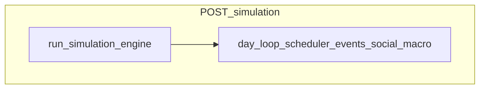
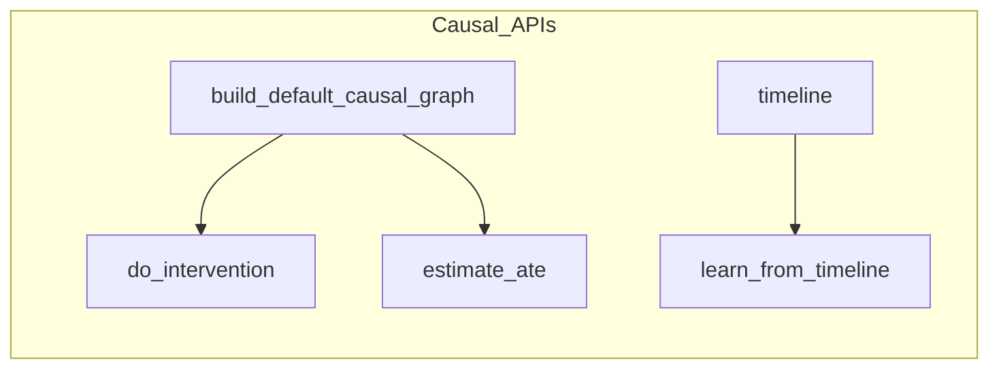
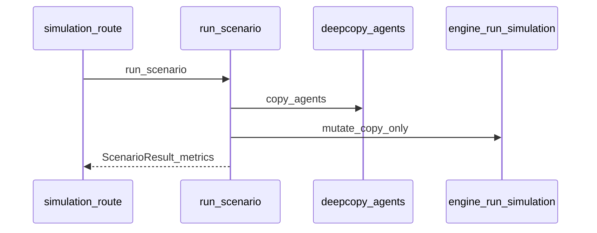

# Simulation API

**Purpose:** Advance **global** agent state over days, schedule world events, run **isolated** scenario experiments (copies), and query a **structural causal** helper graph.

**Prerequisites:** `POST /population/generate` (non-empty [`agents_store`](../../api/state.py); `social_graph` recommended).

**Postman:** folder `simulation`.

**Sample I/O:** [`api_details_input_output.txt`](../../api_details_input_output.txt) — global + events + status ~5301–5348; scenario / compare / run-with-survey / compare-with-survey ~5350–7753; causal ~8373–8645. Shapes below match those captures.

---

## Global vs isolated vs causal

| Class | Endpoints | Mutates `agents_store`? |
|-------|-----------|-------------------------|
| **Global** | `POST /simulation`, `POST /simulation/events` (queue only) | Yes for `/simulation` run; events queue only |
| **Isolated** | `POST /simulation/scenario*` | **No** — [`copy.deepcopy`](../../simulation/scenario.py) of agents |
| **Causal** | `GET/POST .../causal/*` | **No** — analytical graph operations |

---

## POST `/simulation`

### Request (`SimulateRequest`)

| Field | Type | Range | Default |
|-------|------|-------|---------|
| `days` | int | 1–365 | 30 |

### Response field ledger

| Field | Meaning | Source |
|-------|---------|--------|
| `status` | Literal ok | Constant `"ok"` |
| `days` | Echo | Request body |
| `n_agents` | Population size | `len(agents_store)` |

### Trace

[`run_simulation_endpoint`](../../api/routes/simulation.py) → [`run_simulation`](../../simulation/engine.py)(`agents_store`, `days`, `social_graph`, `scheduler`).

### Engine (high level)

[`simulation/engine.py`](../../simulation/engine.py) implements a **per-day pipeline** (scheduled events, research/media, cognitive updates, social diffusion, macro feedback, etc.). The kernel **does not call the LLM**. See file docstring for the ordered 13-step pipeline and vectorized vs scalar paths.

---

## POST `/simulation/events`

### Request (`EventInjectRequest`)

| Field | Purpose |
|-------|---------|
| `day` | Fire day (≥ 0) |
| `type` | e.g. `price_change`, `policy`, `infrastructure`, `market`, `new_service`, `new_metro_station` |
| `payload` | Type-specific dict |
| `district` | Optional scope |

### Response (POST — schedule)

| Field | Meaning | Source |
|-------|---------|--------|
| `status` | `"scheduled"` | Constant in route |
| `event_type` | Echo of `type` | Request body |
| `day` | Echo | Request body |
| `pending_events` | Count after enqueue | `len(app_state.event_scheduler._events)` |

**Trace:** Builds [`SimulationEvent`](../../world/events.py) → [`event_scheduler.add`](../../world/events.py) ([`api/routes/simulation.py`](../../api/routes/simulation.py)).

---

## GET `/simulation/events` & GET `/simulation/status`

| Endpoint | Key outputs | Computation |
|----------|-------------|-------------|
| GET `/events` | `pending_events[]` (`day`, `type`, `district`, `payload`), `global_params` | List comprehension over `event_scheduler._events`; `global_params` from scheduler object ([`api/routes/simulation.py`](../../api/routes/simulation.py)) |
| GET `/status` | `population_size`, `social_graph_loaded`, `pending_events` | `len(agents_store)`, `social_graph is not None`, scheduler length |

---

## POST `/simulation/scenario`

**Isolated run** — does not modify live `agents_store`.

### Request (`ScenarioRunRequest`)

| Field | Purpose |
|-------|---------|
| `name` | Label |
| `days` | Simulation length |
| `seed` | Optional RNG seed via [`SimulationConfig`](../../simulation/config.py) |
| `events` | Timed [`ScenarioEvent`](../../simulation/scenario.py) list |

### Response / metrics

Returned keys match [`run_scenario_endpoint`](../../api/routes/simulation.py) (subset of [`ScenarioResult`](../../simulation/scenario.py)):

| Field | Meaning | Computation |
|-------|---------|-------------|
| `name` | Scenario label | Echo from request |
| `days` | Length run | Echo from request |
| `seed` | RNG seed | Echo from request (via scenario config) |
| `population_size` | Agent count | `len(agents_copy)` |
| `dimension_means` | Mean latent dimensions | [`build_trait_matrix`](../../agents/vectorized.py) + [`vectorized_macro_aggregation`](../../agents/vectorized.py) on **post-run copy** |

**Not in this response:** [`run_scenario`](../../simulation/scenario.py) also computes `belief_means` on the clone, but the route does **not** return it. Use **`POST /simulation/scenario/run-with-survey`** or **`compare-with-survey`** for `belief_means` in JSON.

**Trace:** [`run_scenario`](../../simulation/scenario.py) → `copy.deepcopy(agents)` → `_build_scheduler` → [`run_simulation`](../../simulation/engine.py) (or stepped timeline if `collect_timeline`).

---

## POST `/simulation/scenario/compare`

### Response highlights

| Field | Meaning |
|-------|---------|
| `dimension_diff_b_minus_a` | Per dimension: `mean_b - mean_a` (rounded) |
| `causal_attribution_b` | Partial runs: events-only vs +social vs full ([`run_scenario_with_attribution`](../../simulation/scenario.py)) |
| `causal_counterfactual_values` | If \|diff\|>0.01, `build_default_causal_graph().do(intervention_vars, baseline_means)` |

---

## POST `/simulation/scenario/run-with-survey`

Runs scenario with `collect_timeline=True`, then [`run_survey`](../../simulation/orchestrator.py) per question string on the **clone**.

| Field | Source |
|-------|--------|
| `survey_results` | Map question → survey payload from orchestrator |
| `timeline` | Periodic `_snapshot` entries: `day`, `dimension_means`, `belief_means` |

---

## POST `/simulation/scenario/compare-with-survey`

[`compare_scenarios_with_survey`](../../simulation/scenario.py): two `run_scenario_with_survey` → `dimension_diff_b_minus_a` + per-question `distribution_a` / `distribution_b` / chi-square style `p_value` on scaled counts.

### Response field ledger (compare-with-survey)

| Field | Meaning |
|-------|---------|
| `scenario_a`, `scenario_b` | Each includes `name`, `dimension_means`, `belief_means` from post-run clones |
| `dimension_diff_b_minus_a` | Per latent dimension: \( \bar{x}_B - \bar{x}_A \) |
| `survey_comparison[question]` | `distribution_a`, `distribution_b` (histograms over `sampled_option` or `answer`), `p_value` from chi-square on scaled counts |
| `timeline_a`, `timeline_b` | Snapshots from each scenario’s `collect_timeline` run |

---

## Causal endpoints

### GET `/simulation/causal/graph`

Returns [`build_default_causal_graph().to_dict()`](../../causal/graph.py).

| Key | Meaning |
|-----|---------|
| `nodes` | List of variable names in the default SCM |
| `edges` | List of `{ cause, effect, weight, mechanism? }` directed edges |

### POST `/simulation/causal/do-intervention`

| Body | Role |
|------|------|
| `intervention` | `do(X=x)` assignments |
| `observational` | Optional context for non-intervened nodes |

**Response:** `counterfactual_values` = [`CausalGraph.do`](../../causal/graph.py)(...).

### POST `/simulation/causal/ate`

**Response:** `ate` from [`estimate_ate`](../../causal/graph.py) on default graph (may be `0.0` if structure/estimator does not connect treatment→outcome).

### POST `/simulation/causal/learn`

**Body:** `{ "timeline": [ ... ] }` — each entry should include `dimension_means` for learning.

**Behavior:** [`CausalLearner.learn_from_timeline`](../../causal/learner.py): if `not timeline` or `len(timeline) < 3`, returns **`build_default_causal_graph()`** unchanged (same `nodes`/`edges` as GET `/causal/graph` — see sample file `timeline: []` output ~8531–8645).

| Response key | When learned | When short/empty timeline |
|--------------|--------------|---------------------------|
| `nodes`, `edges` | Learned structure from lagged correlations | **Default graph** from [`build_default_causal_graph`](../../causal/graph.py) |

---

## Diagram — scenario isolation

---

## Configuration

- [`SimulationConfig`](../../simulation/config.py) `master_seed` from scenario `seed`
- Engine thresholds: `VECTORIZE_THRESHOLD` in [`simulation/engine.py`](../../simulation/engine.py)

---

## Cross-links

- [`docs/modules/simulation.md`](../modules/simulation.md), [`docs/modules/causal.md`](../modules/causal.md), [`docs/modules/world.md`](../modules/world.md)
