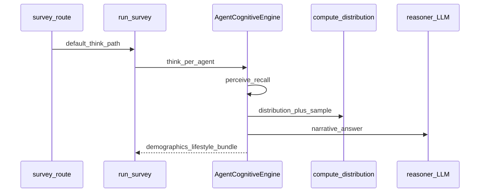

# Survey API

**Purpose:** Run one or many survey questions against [`agents_store`](../../api/state.py); persist results for analytics and evaluation.

**Prerequisites:** Non-empty population (`POST /population/generate`).

**Sample I/O:** [`api_details_input_output.txt`](../../api_details_input_output.txt) — `POST /survey` ~578+, full per-agent `responses` through ~5299; multi/session endpoints ~3704+.

---

## 1. POST `/survey` (synchronous)

### HTTP contract

| Method | Path | Request | Response |
|--------|------|---------|----------|
| POST | `/survey` | [`SurveyRequest`](../../api/schemas.py) | [`SurveyResult`](../../api/schemas.py) |

### Request example (minimal)

```json
{
  "question": "How often do you use food delivery? Options: Never, Rarely, Sometimes, Often, Very Often",
  "question_id": "q1",
  "use_archetypes": false,
  "diagnostics": false,
  "options": null,
  "current_events": null
}
```

Optional debug payload (see also [`examples/survey-request-diagnostics.json`](../examples/survey-request-diagnostics.json)):

```json
{
  "question": "How satisfied are you with public transport in your area?",
  "question_id": "q_transport",
  "use_archetypes": false,
  "diagnostics": true
}
```

| Field | Role |
|-------|------|
| `question` | Text → perception + optional LLM topic detection ([`perceive_with_llm`](../../agents/cognitive.py) when reasoner set). |
| `question_id` | History key; empty → UUID in route. |
| `use_archetypes` | If true and population large enough → representative LLM batch + adaptation ([`run_survey`](../../simulation/orchestrator.py)). |
| `diagnostics` | When **true**, responses may include `response_diagnostics`, richer `decision_trace`, `turn_understanding`, and related fields for debugging ([`run_survey_endpoint`](../../api/routes/survey.py) passes `diagnostics_enabled`). |
| `options` | Passed into narrative as `option_labels`; should align with detected [`QuestionModel.scale`](../../config/question_models.py). |
| `current_events` | Media framing → temporary beliefs in orchestrator. |

### Top-level response ledger (`SurveyResult`)

| Field | How produced |
|-------|----------------|
| `survey_id` | `uuid.uuid4()` in [`run_survey_endpoint`](../../api/routes/survey.py) |
| `question` | Echo of request |
| `responses` | List of [`SurveyResponseItem`](../../api/schemas.py) |
| `n_total` | `len(responses)` |

### Per-item ledger (`SurveyResponseItem`)

| Field | Type | Meaning | How computed |
|-------|------|---------|--------------|
| `agent_id` | string | | `persona.agent_id` |
| `answer` | string | Free-text narrative | `AgentCognitiveEngine.reason` → LLM via [`reasoner_via_llm`](../../llm/prompts.py), conditioned on `sampled_option`, `distribution`, memories, style ([`agents/cognitive.py`](../../agents/cognitive.py) `think`). |
| `interaction_mode` | string \| null | Turn classification | From hybrid understanding / intent routing ([`agents/intent_router.py`](../../agents/intent_router.py)). |
| `turn_understanding` | object \| null | Structured NLU output | Hybrid turn pipeline; often present when understanding runs. |
| `sampled_option` | string \| null | Discrete bucket | After `decide`: draw from `distribution` keys ([`sample_from_distribution`](../../agents/decision.py)). |
| `sampled_option_canonical` | string \| null | Normalized label | [`config/option_space.py`](../../config/option_space.py) canonicalization when applicable. |
| `distribution` | object \| null | option → probability | [`compute_distribution`](../../agents/decision.py). |
| `question_model_key` | string \| null | Resolved model id | From perception / question model detection. |
| `option_space_key` | string \| null | Option-space registry key | Aligns buckets across wording variants. |
| `decision_trace` | object \| null | Pipeline diagnostics | Fallback flags, sampling guards, etc.; richer when `diagnostics=true`. |
| `narrative_alignment_status` | string \| null | Narrative vs option check | From narrative validation layer. |
| `run_metadata` | object \| null | Per-response run info | Optional timing / mode metadata. |
| `response_diagnostics` | object \| null | Debug bundle | Emitted when request `diagnostics=true` ([`jadu-api/README.md`](README.md)). |
| `fallback_flags` | string[] \| null | Short codes | e.g. `decision:fallback`, `sampling:hard_constraint_guard` from orchestrator ([`simulation/orchestrator.py`](../../simulation/orchestrator.py)). |
| `demographics` | object \| null | API-facing slice | From `Persona` in `think` / archetype paths. |
| `lifestyle` | object \| null | Lifestyle slice | `personal_anchors` fields. |
| `error` | string \| null | | Set if agent task raises in [`run_survey`](../../simulation/orchestrator.py) gather. |

**Note:** Raw dicts from `think` may include extra keys; `SurveyResponseItem` is the stable API shape. Stored `survey_results` may retain additional fields.

**Tests:** [`tests/test_response_contract.py`](../../tests/test_response_contract.py), [`tests/test_system_invariants.py`](../../tests/test_system_invariants.py).

### Trimmed response example (one agent)

See sample file for 50 agents; structurally:

```json
{
  "survey_id": "…",
  "question": "…",
  "responses": [
    {
      "agent_id": "DXB_0000",
      "answer": "Multiple times a day…",
      "sampled_option": "multiple per day",
      "distribution": {
        "rarely": 0.035,
        "1-2 per week": 0.026,
        "3-4 per week": 0.055,
        "daily": 0.171,
        "multiple per day": 0.713
      },
      "demographics": { "age_group": "18-24", "nationality": "Emirati", … },
      "lifestyle": { "cuisine_preference": "…", … },
      "error": null
    }
  ],
  "n_total": 50
}
```

### Distribution pipeline ([`compute_distribution`](../../agents/decision.py))

High-level stages (docstring in code):

1. **Factor graph** — [`get_or_build_graph`](../../agents/decision.py) + [`build_factor_graph`](../../agents/factors/__init__.py); perturbed score from persona/context.
2. **Logits** — positions on `question_model.scale`; blend trait vector × [`QuestionModel.dimension_weights`](../../config/question_models.py).
3. **Reference prior** — [`get_reference_distribution(question_model.name, scale)`](../../config/reference_distributions.py) mixed into raw scores (`_PRIOR_WEIGHT`).
4. **Habit bias** — if `agent_state.habit_profile` ([`apply_habit_bias`](../../agents/realism.py)).
5. **Cultural prior** — [`get_cultural_prior`](../../agents/realism.py).
6. **Noise + optional conviction spike.**
7. **Softmax** with per-agent temperature ([`_agent_softmax_temperature`](../../agents/decision.py)).
8. **Dirichlet noise** ([`_inject_dirichlet_noise`](../../agents/decision.py)).
9. **Conviction shaping** ([`apply_conviction_shaping`](../../agents/realism.py)).
10. **Cognitive dissonance** adjustment vs beliefs if `agent_state` present.

Keys of `distribution` are exactly `question_model.scale` for the detected model ([`detect_question_model`](../../agents/perception.py)).

### Core execution trace — POST `/survey`

1. [`run_survey_endpoint`](../../api/routes/survey.py) → validate `agents_store`, `reset_survey_stats`.
2. [`run_survey`](../../simulation/orchestrator.py): optional social warmup, `current_events` / media, `_research_ctx`; may strip qualitative option lists ([`strip_survey_options_if_qualitative`](../../agents/intent_router.py)); builds response contract hints ([`agents/response_contract.py`](../../agents/response_contract.py)).
3. `think_fn=None` → **`default_think`** → [`AgentCognitiveEngine`](../../agents/cognitive.py): hybrid understanding / intent → `perceive` / `perceive_with_llm` → `recall` → `decide` (`compute_distribution` + sample) → invariants ([`evaluation/invariants.py`](../../evaluation/invariants.py)) → `reason` (LLM narrative).
4. `diagnostics_enabled` forwarded from request → richer traces in response items.
5. Persist `survey_results[survey_id]`; append [`response_histories`](../../api/state.py).



---

## 2. GET `/survey/{survey_id}/results`

Returns the same shape as POST response. **404** if unknown id.

| Field | Source |
|-------|--------|
| All | `survey_results[survey_id]` → `items` as `responses` |

---

## 3. POST `/survey/multi`

Request model [`MultiSurveyRequest`](../../api/schemas.py): `questions`, `use_archetypes`, **`diagnostics`**, `social_influence_between_rounds`, `summarize_every`.

| Response field | Meaning |
|----------------|---------|
| `session_id` | UUID for polling |
| `current_round` | Starts at 0 |
| `total_rounds` | `len(questions)` |
| `status` | `running` until background task completes |

**Flow:** [`_run_multi_survey_task`](../../api/routes/survey.py) → [`SurveyEngine.run`](../../simulation/survey_engine.py) → [`JSONLWriter`](../../storage/writer.py) under `data/sessions/`; WebSocket `survey:{session_id}` ([`jadu-api/websockets.md`](websockets.md)); on completion register `survey_results["{session_id}_r{n}"]` and update `response_histories`.

---

## 4. GET `/survey/session/{session_id}/progress`

| Field | Source |
|-------|--------|
| `status`, `completed_questions`, `current_round` | `survey_sessions[session_id]` + `result.rounds` when done |

**404** unknown session; **409** if results requested while running.

---

## 5. GET `/survey/session/{session_id}/results` and `/round/{round_idx}`

Full session or single round; round id aliases `survey_id` to `{session_id}_r{round_idx}` for analytics compatibility.

---

## Worked mini-example (distribution)

Assume two options only and logits `[0.5, 0.2]` after all pre-softmax steps, temperature 1.0:

- Softmax: \(p_i = e^{x_i} / \sum e^{x_j}\) → two probabilities summing to 1.
- Sample: one key drawn with those probabilities → `sampled_option`.
- LLM produces `answer` text consistent with persona + `sampled_option` (not necessarily equal string).

---

## Configuration

[`config/settings.py`](../../config/settings.py): `max_concurrent_llm_calls`, `survey_social_warmup_steps`, `media_weight_survey`, `master_seed`, archetype thresholds.

---

## Known limitations

- **`options` vs model scale:** If API options do not match `QuestionModel.scale` keys, narratives may disagree with buckets; align domain `topic_to_model_key` and [`QUESTION_MODELS`](../../config/question_models.py).
- **Archetype path** uses a **fresh** `AgentState.from_persona` for non-reps when computing `decide` for comparison — different from default path’s cached state (documented for debugging).

---

## Cross-links

- [Simulation](../modules/simulation.md), [LLM](../modules/llm.md)
- [Examples: trimmed survey response](../examples/survey-response-trimmed.json)
