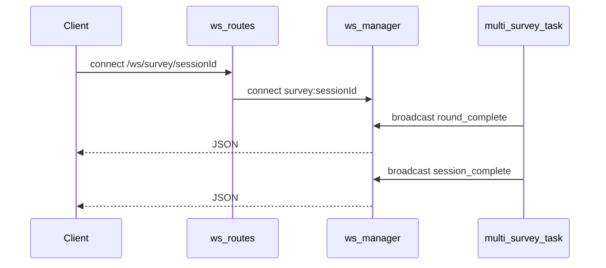

# WebSocket API

**Purpose:** Real-time updates for multi-question survey sessions and a bidirectional channel for simulation-related commands.

**Prerequisites:** For survey progress, start a session with `POST /survey/multi` and use the returned `session_id` in the WebSocket path.

**Manager implementation:** [`api/websocket.py`](../../api/websocket.py) (`ws_manager`: connect, disconnect, broadcast, send_personal). **Routes:** [`api/routes/websocket.py`](../../api/routes/websocket.py).

---

## 1. `WS /ws/survey/{session_id}`

Subscribe before or after starting `POST /survey/multi` with the same `session_id`. The server uses channel name `survey:{session_id}`.

### Client → server

The handler reads incoming text in a loop (e.g. keep-alive pings). Payload is not interpreted for survey logic.

### Server → client (JSON)

**After each round** ([`_on_progress` in `api/routes/survey.py`](../../api/routes/survey.py)):

```json
{
  "event": "round_complete",
  "session_id": "<uuid>",
  "round_idx": 0,
  "total_rounds": 5,
  "question": "…",
  "n_responses": 500
}
```

**When all rounds finish successfully:**

```json
{
  "event": "session_complete",
  "session_id": "<uuid>",
  "total_responses": 2500,
  "elapsed_seconds": 120.5
}
```

**On failure:**

```json
{
  "event": "session_failed",
  "session_id": "<uuid>",
  "error": "<exception message>"
}
```

### REST alternatives

- `GET /survey/session/{session_id}/progress` — poll status.
- `GET /survey/session/{session_id}/results` — full session when completed.

---

## 2. `WS /ws/simulation`

Channel name: `simulation`.

### Client → server

JSON messages, e.g.:

**Schedule an event** (adds to [`event_scheduler`](../../api/state.py)):

```json
{
  "action": "inject_event",
  "day": 5,
  "type": "price_change",
  "payload": {},
  "district": null
}
```

**Population snapshot:**

```json
{ "action": "status" }
```

### Server → client

- Ack for inject: `{ "ack": "event_scheduled", "type": "...", "day": 5 }`
- Status: `{ "population_size": 500 }`
- Bad JSON: `{ "error": "invalid JSON" }`
- Unknown action: `{ "error": "unknown action: ..." }`

**Note:** The route docstring mentions `pause` / `resume`; the current branch may not implement them — treat as **experimental** until verified in code.

---

## Execution trace

1. Client opens WebSocket → FastAPI route → `ws_manager.connect(channel, websocket)`.
2. Survey task → `ws_manager.broadcast("survey:{session_id}", payload)` on progress.
3. Disconnect → `ws_manager.disconnect(channel, websocket)`.



---

## Cross-links

- [Survey API](survey.md) — multi-survey HTTP contract.
- [Module: API](../modules/api.md) — shared state and schema overview.
