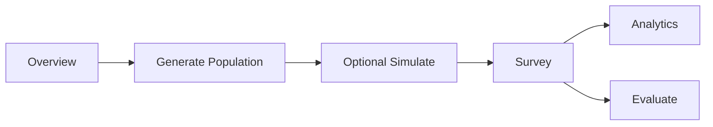

# JADU — Project Overview

## What This Project Does

JADU is a research-grade **synthetic society simulation platform** that models how large populations form opinions, react to information, and generate emergent social phenomena. You generate a synthetic population (e.g. Dubai demographics), run surveys or multi-day simulations with media and social influence, and get segmented analytics and evaluation reports (realism, drift, consistency, distribution fit, optional LLM-as-judge). The system answers “what would this population say?” under different scenarios and can be calibrated to match real survey distributions.

## How the Pieces Connect

- **Architecture** ([architecture.md](architecture.md)): End-to-end flow, API request flow, cognitive pipeline, 13-step simulation loop, calibration/discovery/evaluation flows, and data flow from persona to survey response.
- **Module Reference**: Per-folder documentation (classes, functions, and “how” for each file) under [Module Reference](modules/agents.md) in the nav (Agents, Analytics, API, Calibration, Config, Causal, Data, Discovery, Evaluation, LLM, Media, Memory, Population, Postman, Research, Simulation, Social, Storage, World, Tests).
- **Root Scripts** ([root-scripts.md](root-scripts.md)): `main.py`, `regenerate_survey.py`, `benchmark_scale.py`, `validate_realism.py` — entry point and standalone scripts.

## Project at a Glance



Generate population → optionally run simulation days → run survey(s) → get analytics by segment and/or run evaluation (realism, drift, consistency, distribution, judge).

## Key Features

- **Synthetic population generation**: Monte Carlo, IPF (Iterative Proportional Fitting), and Bayesian conditional sampling to match real Dubai demographics (age, nationality, income, location, occupation).
- **Agent cognitive architecture**: Perception → Memory → Personality → Decision (probabilistic) → LLM reasoning. Hybrid model: statistics from probability, narrative from LLM.
- **Social network**: Barabasi-Albert graph with friend/coworker/neighbor edges; opinion diffusion and adoption cascades.
- **World model**: Dubai districts (metro access, parking, restaurant density); economy (budget allocation); events (e.g. new metro station).
- **Memory**: Episodic, semantic, and behavioral memory with ChromaDB (or in-memory fallback).
- **Survey orchestration**: Async execution across agents; optional archetype compression to reduce LLM calls (e.g. 500 agents → ~80 LLM calls).
- **Analytics**: Aggregation by segment (location, income, nationality, age); automated insights and visualization.
- **Evaluation**: Population realism (JS divergence), drift detection, cross-question consistency, LLM-as-judge (realism, persona consistency, cultural plausibility).

## Quick Start

### 1. Install

```bash
cd Socio_Sim_AI
pip install -r requirements.txt
```

### 2. Environment

Copy `.env.example` to `.env` and set:

- `OPENAI_API_KEY` – required for agent reasoning and optional LLM judge.

### 3. Run API

```bash
python main.py run
```

Server: `http://0.0.0.0:8000`. Docs: `http://localhost:8000/docs`.

### 4. Typical Flow

1. **Generate population**  
   `POST /population/generate` with `{"n": 500, "method": "bayesian"}`.

2. **Optional: run simulation**  
   `POST /simulation` with `{"days": 30}` to update social influence and state.

3. **Run survey**  
   `POST /survey` with `{"question": "How often do you order food delivery?"}`. Returns `survey_id`.

4. **Get analytics**  
   `GET /analytics/{survey_id}?segment_by=location`.

5. **Evaluate**  
   `POST /evaluate/{survey_id}` with `{"run_judge": false}` (or `true` for LLM judge).

## Scaling and Cost

- **Archetypes**: For 500+ agents, set `use_archetypes: true` in the survey request to route LLM calls through cluster representatives (~80 calls instead of 500).
- **Memory**: Set `CHROMA_PERSIST_DIR` to persist agent memory; otherwise in-memory store is used.
- **Validation**: Adjust `POPULATION_REALISM_THRESHOLD` and `DRIFT_THRESHOLD` in `.env` or config.

## CLI Commands

| Command | Description |
|--------|-------------|
| `python main.py run` | Start API server on port 8000 |
| `python main.py generate [N]` | Generate N agents (default 100) and validate realism score |

## Project Layout

| Folder | Description |
|--------|-------------|
| `config/` | Settings (Pydantic), domain config (domain.py), demographics from JSON (demographics.py), question models, belief mappings |
| `data/domains/` | Domain configs per city: e.g. `dubai/domain.json`, `demographics.json`, `reference_distributions.json` |
| `discovery/` | Dimension discovery, domain auto-setup, action inference |
| `causal/` | Causal learner and graph (optional) |
| `population/` | Synthesis (Monte Carlo, IPF, Bayesian), personas, validator |
| `agents/` | Cognitive pipeline (perception, personality, decision, state) |
| `llm/` | OpenAI client (rate-limited), prompts, reasoner |
| `social/` | Network (Barabasi-Albert), influence (opinion diffusion) |
| `world/` | City graph, districts, economy, events |
| `memory/` | Types (episodic, semantic, behavioral), ChromaDB store |
| `simulation/` | Engine (daily loop), orchestrator (survey), archetypes, timeline |
| `analytics/` | Aggregation, insights, visualization |
| `evaluation/` | Realism, consistency, drift, LLM judge, report |
| `calibration/` | Factor weight learning, real data loader, calibration pipeline |
| `api/` | FastAPI app, schemas, routes |

## License

MIT.
